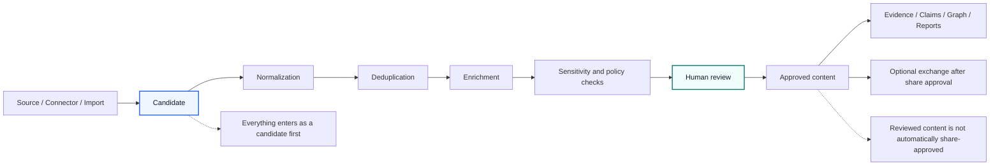
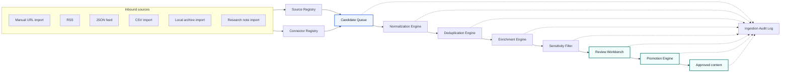
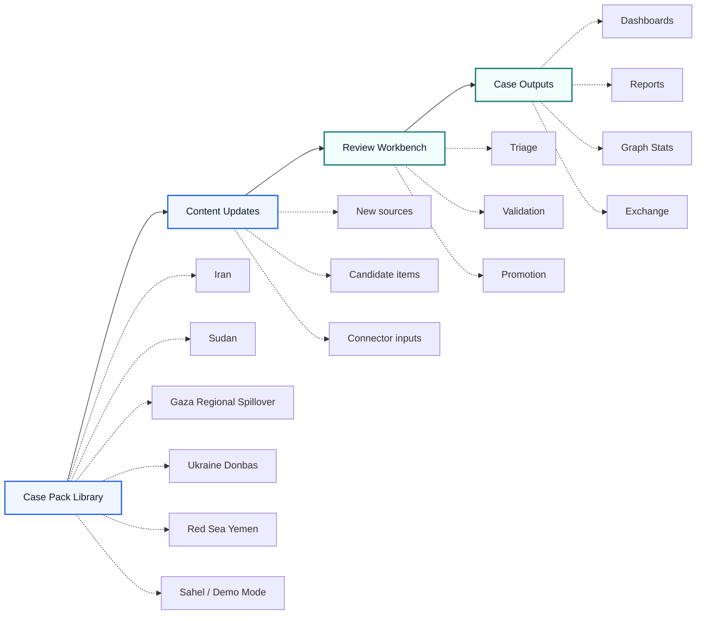

# LegoLens Core v2.0.0

**LegoLens Core** is a neutral, review-first intelligence platform for monitoring complex information environments, collecting new signals as candidates, reviewing them with analyst oversight, and exchanging structured intelligence through open standards.

Version **2.0.0** professionalizes the framework with multi-case dashboards, content acquisition, candidate-only updates, graph statistics, stable chart rendering, external connector templates and an Exchange Center model for STIX/TAXII/MISP and related standards.

---

## Visual framework overview

The following diagrams summarize the main operating model of LegoLens Core. They use GitHub-native Mermaid rendering instead of external image files, so they remain readable in the repository README and avoid cropped or distorted image previews.

### Review-first workflow



This diagram explains the central safety and quality principle of LegoLens Core: every source, connector import or content update enters the system as a candidate first. Information is normalized, deduplicated, enriched and checked before human review can promote it to approved content. The workflow also highlights the important distinction between internally reviewed content and content that is explicitly approved for external sharing.

### Content acquisition layer



This diagram shows how new material enters the framework through manual imports, feeds, archives and research notes. Source and connector registries keep ingestion structured, while the Candidate Queue ensures that raw inbound items remain separate from approved content. The Ingestion Audit Log records processing and review outcomes for traceability.

### Controlled exchange model

```mermaid
flowchart LR
    subgraph External[External standards and platforms]
        STIX[STIX 2.1]
        TAXII[TAXII 2.1]
        MISP[MISP]
        CACAO[CACAO]
        OTHER[Sigma / YARA / GeoJSON]
    end

    External --> IC[Import as candidates]
    IC --> CR[Candidate review]
    CR --> AP[Approved content]
    AP --> SA[Share approval]
    SA --> EXP[Controlled export]

    subgraph Outputs[Approved exchange outputs]
        O1[STIX package]
        O2[TAXII push]
        O3[MISP event]
        O4[Other approved exchange]
    end

    EXP --> Outputs

    IC -.-> R1[Imported external data enters as candidates]
    SA -.-> R2[Export requires explicit sharing approval]

    classDef import fill:#eff6ff,stroke:#2563eb,stroke-width:2px,color:#0f172a;
    classDef approval fill:#f0fdfa,stroke:#0f766e,stroke-width:2px,color:#0f172a;
    class IC,EXP import;
    class CR,AP,SA approval;
```



This diagram summarizes controlled interoperability with external standards and platforms such as STIX, TAXII, MISP, CACAO, Sigma, YARA and GeoJSON. Imported data is routed through the same review-first process as other inbound material, while export requires a separate share-approval gate. Secrets and API credentials remain backend-only.

### Analyst workflow



This diagram presents the analyst-facing workflow from case pack selection to case outputs. Analysts work with separate case packs, process content updates, use the Review Workbench for triage and validation, and produce dashboards, reports, graph statistics and controlled exchange outputs. Multiple cases use one consistent workflow while keeping per-case dashboards and outputs separate.

---

## Available languages

LegoLens Core can be used and explained with the included multilingual publication and usage notes in the following languages:

- English
- 中文（简体）
- हिन्दी
- Español
- العربية
- Français
- বাংলা
- Português
- Русский
- اردو
- Bahasa Indonesia
- Deutsch
- 日本語
- Nederlands

The primary repository and interface documentation remains in English. The multilingual files are available in `docs/i18n/`, with a combined overview in `docs/PUBLICATION_EXPLANATION_MULTILINGUAL.md`.

---

## Why LegoLens exists

Complex information environments generate many fragmented signals: source reports, media items, claims, evidence fragments, analyst notes, graph relationships and external intelligence packages. LegoLens provides a structured workflow to keep these signals traceable.

The framework is designed for:

- OSINT and conflict-monitoring workflows.
- Human-in-the-loop intelligence review.
- Multi-case evidence and source management.
- Candidate-based content ingestion.
- Graph and report generation.
- Controlled sharing with external platforms and standards.

The core principle is simple:

```text
No connector, import or update may directly create approved content.
Everything enters as a candidate first.
```

---

## What is included in v2.0

### Core platform

- Neutral LegoLens Core branding.
- Review-first workflow.
- Candidate-only ingestion.
- Multi-case Case Pack Library.
- Local-first runtime with optional backend server.
- Publication-safe repository structure.
- Release validation scripts and smoke tests.

### Case packs

Included case packs:

- Iran
- Sudan
- Gaza Regional Spillover
- Ukraine Donbas
- Red Sea Yemen
- Sahel
- Demo Mode

Each case pack is intended to include metadata, sources, content items, claims, evidence, reports, graph data and risk context.

### v2 interface sections

- **Datasets** — browse case-pack datasets and content previews.
- **Case Dashboards** — per-case visual dashboard with preview cards.
- **Content Updates** — candidate-only update workflow.
- **Ingestion** — connector and source-management model.
- **External Connections** — configuration templates for external systems.
- **Exchange** — STIX/TAXII/MISP and open-standard exchange model.
- **Graph Stats** — dataset and graph-coverage statistics.
- **Review** — analyst review workflow and candidate promotion.

---

## Screenshots and interface guide

A visual screenshot guide is included in the repository:

- [Screenshot guide](docs/screenshots/v2_0/README.md)
- [Overview dashboard](docs/screenshots/v2_0/01-overview.svg)
- [Case Pack Datasets](docs/screenshots/v2_0/02-datasets.svg)
- [Content Update Center](docs/screenshots/v2_0/03-content-updates.svg)
- [Ingestion and External Connections](docs/screenshots/v2_0/04-ingestion-external-connections.svg)
- [Exchange Center](docs/screenshots/v2_0/05-exchange-center.svg)
- [Graph Dataset Statistics](docs/screenshots/v2_0/06-graph-stats.svg)

The checked-in screenshots are lightweight SVG documentation mockups. They are designed to explain the intended v2.0 interface structure without committing large binary screenshot files to the repository.

---

## Core workflow

```text
Source / Connector / Import
→ Candidate
→ Normalization
→ Deduplication
→ Enrichment
→ Sensitivity and policy checks
→ Human review
→ Approved content
→ Evidence / Claims / Graph / Reports
→ Optional exchange after share approval
```

Important distinction:

```text
reviewed ≠ share-approved
```

An item can be approved for internal analysis without being approved for external sharing.

---

## Content Acquisition Layer

The Content Acquisition Layer defines how new material enters LegoLens.

Main components:

- Source Registry
- Connector Registry
- Candidate Queue
- Normalization Engine
- Deduplication Engine
- Enrichment Engine
- Sensitivity Filter
- Review Workbench
- Promotion Engine
- Ingestion Audit Log

Supported connector directions:

- Manual URL import
- RSS
- JSON feed
- CSV import
- Local archive import
- Research note import
- Future external APIs

See: `docs/CONTENT_ACQUISITION_LAYER.md`

---

## Exchange and open standards

LegoLens v2.0 includes an interoperability model for controlled exchange.

Supported or planned standards and platforms:

- STIX 2.1
- TAXII 2.1
- MISP Event JSON/API
- MISP Taxonomies
- MISP Galaxies
- CACAO Security Playbooks
- OpenC2
- Sigma
- YARA
- CSAF
- OSCAL
- OCSF
- MITRE ATT&CK / STIX
- OpenAPI
- GeoJSON
- SPDX
- CycloneDX

Exchange rules:

- Imported STIX/MISP/TAXII data enters as candidates.
- Export requires explicit sharing approval.
- MISP `to_ids` must not become true automatically.
- MISP distribution must not become public automatically.
- TAXII/MISP API sync is backend-only.
- Secrets must never be stored in frontend code.

See: `docs/EXTERNAL_STANDARDS_CONNECTORS_V2.md`

---

## Start locally

```bash
npm run build
npm run validate
npm test
npm run release:check
node backend/server.mjs
```

Open:

```text
http://localhost:8787
```

Browser-only mode supports local interaction and file-based workflows. Backend mode is required for future scheduled ingestion, TAXII push, MISP API sync and secure connector credentials.

---

## Validation

Use:

```bash
npm run build
npm run validate
npm test
npm run release:check
```

The compact GitHub release gate checks:

- release metadata
- required runtime files
- case-pack index
- v2 release documentation
- package scripts
- publication-safe file types
- v2 smoke test

---

## Documentation

Important documents:

- `docs/RELEASE_V2_0.md`
- `docs/CONTENT_ACQUISITION_LAYER.md`
- `docs/EXTERNAL_STANDARDS_CONNECTORS_V2.md`
- `docs/ROADMAP_TO_V2.md`
- `docs/INTELLIGENCE_QUALITY_v1_2.md`
- `docs/PUBLICATION_EXPLANATION_MULTILINGUAL.md`
- `docs/i18n/README.md`
- `docs/screenshots/v2_0/README.md`

---

## Responsible use

LegoLens is a review-first framework. Starter content, external imports and generated candidates are for triage and workflow testing. Do not publish or exchange findings externally without analyst review, corroboration and sharing approval.

Sensitive claims, PII, casualty-related claims, allegations, visual evidence and vulnerable-location data require extra review before use or sharing.
