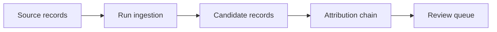
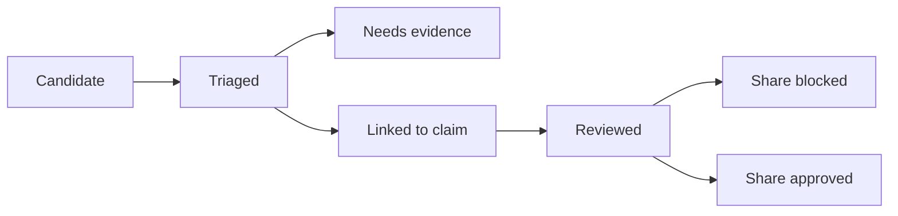
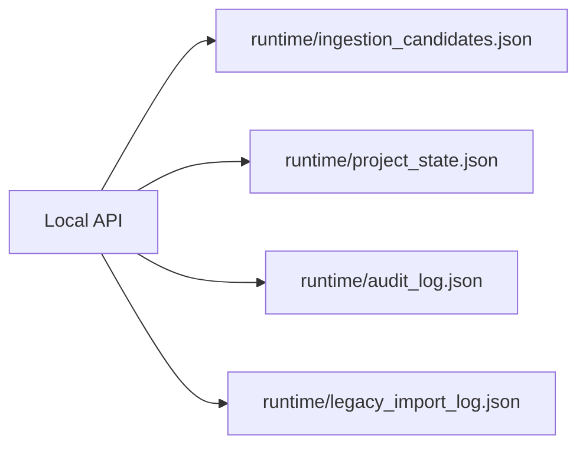
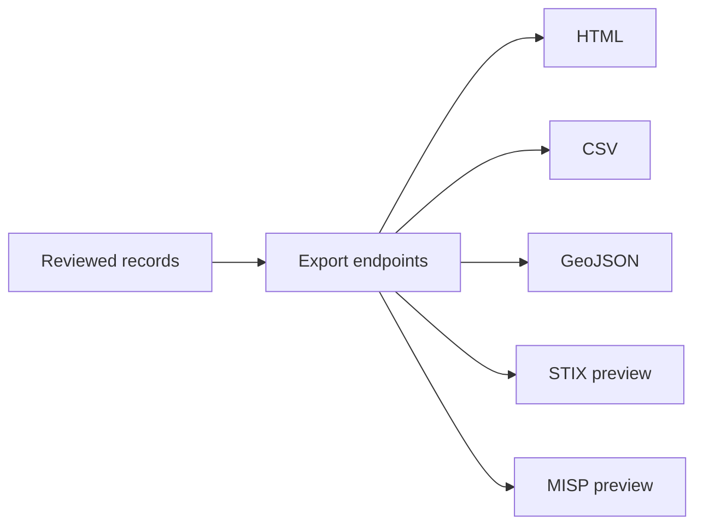

# LegoLens Core v3.0.0

**LegoLens Core** is a local-first, review-first intelligence workspace for collecting source material as candidates, preserving attribution, reviewing findings, and exporting controlled local previews.

Version **3.0.0** is organized around explicit system workflows: candidate-only ingestion, persistent runtime state, analyst review, share approval, legacy import, audit logging, backup/restore, safe local exports, and reproducible real interface screenshot capture.

---

## Release status

- **Current release:** `v3.0.0`
- **Runtime model:** local Node.js backend with static browser UI
- **Data model:** local JSON registries plus generated runtime files
- **Safety model:** review-first, candidate-only ingestion, explicit share approval

Core rule:

```text
No connector, import, sync or update may directly create approved content.
Everything enters as a candidate first.
```

Important distinction:

```text
reviewed != share_approved
```

---

## System workflows

### 1. Candidate-only ingestion



New material from source records, all-case sync or imports is stored as candidates first. The all-case sync endpoint is:

```text
POST /api/ingestion/run-all
```

### 2. Review and share approval



Review status and share approval are separate states. Internal review does not automatically permit external exchange.

### 3. Runtime persistence and audit trail



Runtime files are generated locally and should not be committed with analyst data.

### 4. Controlled export previews



Exports are local previews and must not include connector secrets or private credentials.

### 5. Screenshot capture workflow

Real interface screenshots are generated from the running browser interface, not drawn as documentation mockups.

```text
npm run screenshots:capture
```

The capture script renders every route defined in `data/app_data.json` and writes PNG files plus a manifest to `docs/screenshots/v3_0/`.

---

## Attribution model

The shared attribution chain is:

```text
Repository -> Case -> Source family -> Source -> Platform -> Narrative -> Item -> Review state
```

This chain is reused across Content Updates, Media Library, Graph Stats, Investigate and Reports.

---

## Included in v3.0.0

- Persistent local candidate store.
- Persistent local project state.
- Audit trail for ingestion, review, import, backup and restore.
- `POST /api/ingestion/run-all` for all-case candidate-only source sync.
- Review states: `candidate`, `triaged`, `needs_evidence`, `linked_to_claim`, `reviewed`, `rejected`, `share_blocked`, `share_approved`.
- Legacy JSON import support for `items.json`, `sources.json`, `claims.json`, `evidence.json` and media manifests.
- Media/source records with source, platform, status, URL status and attribution chain.
- Local export previews for HTML, CSV, GeoJSON, STIX and MISP.
- Backend-only connector references; secrets are not exported.
- Real browser screenshot capture workflow for v3 route documentation.

---

## Case packs

The v3 registry includes:

- Iran
- Sudan
- Gaza Regional Spillover
- Ukraine Donbas
- Red Sea Yemen
- Sahel
- Demo Mode

---

## Main API endpoints

### Health and runtime

```text
GET  /api/health
GET  /api/project/state
POST /api/project/backup
POST /api/project/restore
GET  /api/audit
```

### Ingestion

```text
POST /api/ingestion/run
POST /api/ingestion/run-all
POST /api/ingestion/clear
GET  /api/ingestion/candidates
```

Example:

```http
POST /api/ingestion/run-all
Content-Type: application/json

{
  "limit_per_case": 40
}
```

### Review

```text
GET  /api/review/states
POST /api/review/update
```

### Legacy import

```text
POST /api/legacy/import
```

### Reports and exports

```text
GET /api/reports/export?case_id=iran&format=html
GET /api/reports/export?case_id=iran&format=csv
GET /api/reports/export?case_id=iran&format=geojson
GET /api/reports/export?case_id=iran&format=stix
GET /api/reports/export?case_id=iran&format=misp
```

---

## Start locally

Requirements:

- Node.js `>=20`
- npm

```bash
npm install
npm start
```

Open:

```text
http://localhost:8787
```

---

## Validation

```bash
node --check app_v3.js
node --check compat.js
node --check backend/server.mjs
npm test
npm run browser:smoke
npm run release:check
npm run ingestion:run-all
npm run screenshots:capture
```

The release checks validate:

- v3.0.0 metadata.
- v3 browser entrypoint.
- Candidate-only all-case ingestion.
- Runtime candidate persistence.
- Review/share approval separation.
- Legacy import.
- HTML, CSV, GeoJSON, STIX-preview and MISP-preview exports.
- Export safety for secret-like values.
- Reproducible real interface screenshot capture.

---

## Screenshots and interface guide

Real v3.0 interface screenshots are generated from the running application, not drawn as mockups.

- [v3.0 screenshot guide](docs/screenshots/v3_0/README.md)
- Screenshot generator: `scripts/capture_v3_screenshots.py`

Generate the full route screenshot set locally:

```bash
npm run screenshots:capture
```

The generator writes `01-dashboard.png` through `19-settings.png` plus `manifest.json` to `docs/screenshots/v3_0/`.

---

## Documentation

Important documents:

- `docs/RELEASE_NOTES_V3_0_0.md`
- `docs/QC_REPORT_V3_0_0.md`
- `docs/CONTENT_ACQUISITION_LAYER.md`
- `docs/screenshots/v3_0/README.md`

---

## Repository cleanup policy

The v3.0.0 release branch keeps the repository focused on the active local-first runtime.

Removed from the release documentation and active runtime path:

- obsolete v2 screenshot/mockup files;
- obsolete v3 screenshot mockup files;
- superseded final-report duplicates;
- legacy frontend entrypoints not loaded by `index.html`;
- package scripts that point to missing files;
- duplicate validation workflows.

Runtime-generated data under `runtime/` should not be committed.

---

## Responsible use

LegoLens is a review-first framework. Starter content, external imports and generated candidates are for triage and workflow testing. Do not publish or exchange findings externally without analyst review, corroboration and explicit sharing approval.

Sensitive claims, PII, casualty-related claims, allegations, visual evidence and vulnerable-location data require extra review before use or sharing.
