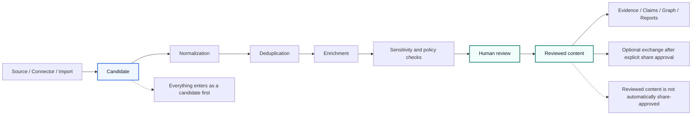
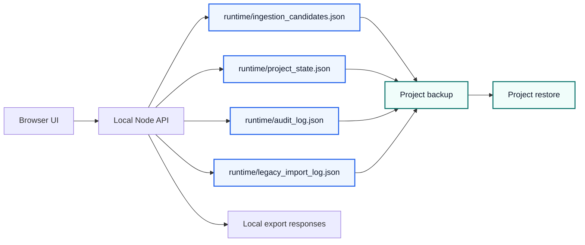
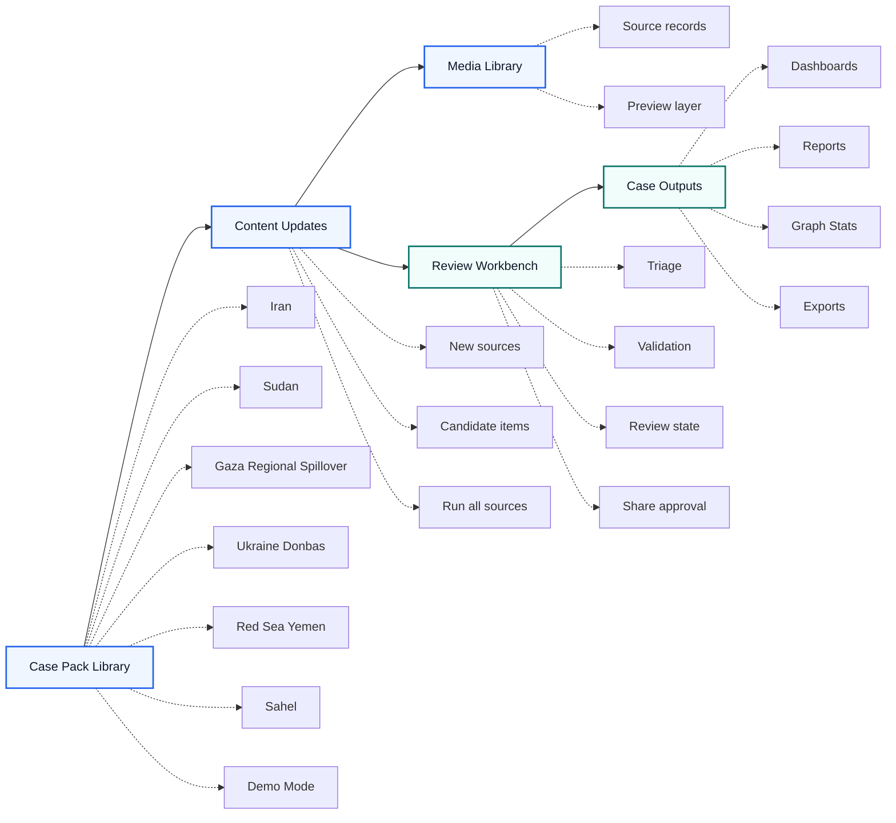

# LegoLens Core v3.0.0

**LegoLens Core** is a neutral, review-first intelligence platform for monitoring complex information environments, collecting new signals as candidates, reviewing them with analyst oversight, and exchanging structured intelligence through open standards.

Version **3.0.0** turns the LegoLens Core workflow into a local-first release with persistent project state, candidate-only all-case ingestion, explicit review and sharing gates, legacy JSON import, media/source attribution, audit logging, local backup/restore and safe export previews for HTML, CSV, GeoJSON, STIX and MISP.

---

## Release status

**Current release:** `v3.0.0`  
**Release type:** final local release  
**Runtime model:** local-first Node backend with static browser UI  
**Safety model:** review-first, candidate-only ingestion, explicit share approval

The central rule remains unchanged:

```text
No connector, import, sync or update may directly create approved content.
Everything enters as a candidate first.
```

Important distinction:

```text
reviewed ≠ share-approved
```

An item can be approved for internal analysis without being approved for external sharing.

---

## Visual framework overview

The following diagrams summarize the main operating model of LegoLens Core. They use GitHub-native Mermaid rendering instead of external image files, so they remain readable in the repository README and avoid cropped or distorted image previews.

### Review-first workflow



This diagram explains the central safety and quality principle of LegoLens Core: every source, connector import or content update enters the system as a candidate first. Information is normalized, deduplicated, enriched and checked before human review can promote it for analytical use. External sharing remains a separate approval step.

### Content acquisition layer

```mermaid
flowchart LR
    subgraph Sources[Inbound sources]
        S1[Manual URL import]
        S2[RSS / JSON / CSV]
        S3[Local archive import]
        S4[Legacy project JSON]
        S5[Media manifests]
        S6[Connector templates]
    end

    Sources --> SR[Source Registry]
    Sources --> CR[Connector Registry]
    SR --> CQ[Candidate Queue]
    CR --> CQ
    CQ --> N[Normalization Engine]
    N --> D[Deduplication / Merge Checks]
    D --> E[Attribution Chain]
    E --> SF[Sensitivity and policy checks]
    SF --> RW[Review Workbench]
    RW --> RS[Review State Store]
    RS --> AC[Reviewed / Rejected / Share-approved states]

    CQ -.-> AL[Audit Log]
    N -.-> AL
    D -.-> AL
    E -.-> AL
    RW -.-> AL
    RS -.-> AL

    classDef queue fill:#eff6ff,stroke:#2563eb,stroke-width:2px,color:#0f172a;
    classDef review fill:#f0fdfa,stroke:#0f766e,stroke-width:2px,color:#0f172a;
    class CQ queue;
    class RW,RS,AC review;
```



The Content Acquisition Layer keeps inbound material separate from approved analytical output. In v3.0.0, the all-case ingestion endpoint stores source results as persistent candidate-only records with original source reference, URL status and attribution chain.

### Persistent local project model



Version 3.0.0 adds persistent local runtime files so candidates, imports, review states and audit events survive server restarts.

### Controlled exchange model

```mermaid
flowchart LR
    subgraph External[External standards and platforms]
        STIX[STIX 2.1]
        TAXII[TAXII 2.1]
        MISP[MISP]
        CACAO[CACAO]
        OTHER[Sigma / YARA / GeoJSON]
    end

    External --> IC[Import as candidates]
    IC --> CR[Candidate review]
    CR --> AP[Reviewed content]
    AP --> SA[Explicit share approval]
    SA --> EXP[Controlled local export]

    subgraph Outputs[Exchange outputs]
        O1[STIX preview]
        O2[MISP preview]
        O3[GeoJSON]
        O4[HTML / CSV]
    end

    EXP --> Outputs

    IC -.-> R1[Imported external data enters as candidates]
    SA -.-> R2[Export requires explicit sharing approval]

    classDef import fill:#eff6ff,stroke:#2563eb,stroke-width:2px,color:#0f172a;
    classDef approval fill:#f0fdfa,stroke:#0f766e,stroke-width:2px,color:#0f172a;
    class IC,EXP import;
    class CR,AP,SA approval;
```



STIX and MISP outputs in v3.0.0 are local previews. TAXII/MISP API sync and external pushes remain backend-only connector responsibilities and must not expose secrets to frontend code or exports.

### Analyst workflow



Analysts work with separate case packs, process content updates, inspect media/source records, review candidates and create controlled outputs. Multiple cases use one consistent attribution model while keeping per-case dashboards and outputs separate.

---

## What is included in v3.0.0

### Core platform

- Neutral LegoLens Core branding.
- Review-first workflow.
- Candidate-only ingestion for single-case and all-case runs.
- Persistent local project state.
- Persistent runtime candidate queue.
- Audit trail for ingestion, review, import, backup and restore operations.
- Legacy JSON import support.
- Media/source preview records with source, platform, status, URL status and attribution chain.
- Local backup and restore endpoints.
- Local report/export endpoints.
- Release validation scripts and smoke tests.

### v3.0.0 release additions

- `POST /api/ingestion/run-all` for framework-wide source sync.
- Candidate output remains candidate-only by default.
- Review states:
  - `candidate`
  - `triaged`
  - `needs_evidence`
  - `linked_to_claim`
  - `reviewed`
  - `rejected`
  - `share_blocked`
  - `share_approved`
- Consistent attribution chain:

```text
Repository → Case → Source family → Source → Platform → Narrative → Item → Review state
```

- Server-side exports:
  - HTML
  - CSV
  - GeoJSON
  - STIX-preview
  - MISP-preview
- Secrets remain backend-only references and are excluded from exports.

### Case packs

Included case packs:

- Iran
- Sudan
- Gaza Regional Spillover
- Ukraine Donbas
- Red Sea Yemen
- Sahel
- Demo Mode

Each case pack is intended to include metadata, sources, content items, claims, evidence, reports, graph data, risk context and source-attribution records.

### Interface sections

- **Datasets** — browse case-pack datasets and content previews.
- **Case Dashboards** — per-case visual dashboard with preview cards.
- **Content Updates** — candidate-only update workflow and run-all sync.
- **Ingestion** — connector and source-management model.
- **Media Library** — preview layer for media/source records and attribution chains.
- **External Connections** — backend-only connector reference model.
- **Exchange** — STIX/MISP/GeoJSON and open-standard export previews.
- **Graph Stats** — dataset, graph and attribution coverage.
- **Investigate** — trace items, sources and review states.
- **Review** — analyst review workflow and explicit share approval.
- **Reports** — local exports with attribution chain.

---

## Legacy import

The v3.0.0 backend supports local JSON import for legacy project data:

- `items.json`
- `sources.json`
- `claims.json`
- `evidence.json`
- media manifests

Imported records are preserved as project data and remain subject to the review-first workflow. Unknown or legacy fields should be retained as source context where possible rather than silently discarded.

---

## Local runtime files

Runtime data is stored locally under `runtime/`:

```text
runtime/ingestion_candidates.json
runtime/project_state.json
runtime/audit_log.json
runtime/legacy_import_log.json
```

These files are generated at runtime and should normally stay out of publication commits unless a deliberate fixture or sample dataset is being added.

---

## Main API endpoints

### Health and runtime

```text
GET  /api/health
GET  /api/project/state
POST /api/project/backup
POST /api/project/restore
GET  /api/audit
```

### Ingestion

```text
POST /api/ingestion/run
POST /api/ingestion/run-all
POST /api/ingestion/clear
GET  /api/ingestion/candidates
```

Example all-case ingestion request:

```http
POST /api/ingestion/run-all
Content-Type: application/json

{
  "limit_per_case": 40
}
```

### Review

```text
GET  /api/review/states
POST /api/review/update
```

Example review update:

```http
POST /api/review/update
Content-Type: application/json

{
  "candidate_id": "candidate_id_here",
  "review_status": "reviewed",
  "reviewer": "analyst",
  "note": "Reviewed for internal analysis. Not share-approved."
}
```

### Legacy import

```text
POST /api/legacy/import
```

### Reports and exports

```text
GET /api/reports/export?case_id=iran&format=html
GET /api/reports/export?case_id=iran&format=csv
GET /api/reports/export?case_id=iran&format=geojson
GET /api/reports/export?case_id=iran&format=stix
GET /api/reports/export?case_id=iran&format=misp
```

---

## Start locally

Requirements:

- Node.js `>=20`
- npm

Install dependencies:

```bash
npm install
```

Start the local backend:

```bash
npm start
```

Open:

```text
http://localhost:8787
```

Browser-only mode supports local interaction and file-based workflows. Backend mode is required for persistent candidates, run-all ingestion, backup/restore, audit logs, server-side exports and secure connector references.

---

## Validation

Use the v3 release checks:

```bash
node --check app.js
node --check compat.js
node --check backend/server.mjs
npm test
npm run browser:smoke
npm run release:check
npm run ingestion:run-all
```

The final release gate checks:

- v3.0.0 release metadata.
- Candidate-only all-case ingestion.
- Runtime candidate persistence after restart.
- Project-state persistence after restart.
- Review/share gate separation.
- Legacy import for items, sources, claims, evidence and media manifests.
- HTML, CSV, GeoJSON, STIX-preview and MISP-preview exports.
- Export safety: no secret-like values in local export output.
- Audit events for ingestion and review.

### Final release gate summary

```json
{
  "release": "v3.0.0",
  "cases_tested": 7,
  "candidate_outputs": 104,
  "stored": 104,
  "counts": {
    "fetch_error": 17,
    "metadata_only": 87
  },
  "persisted_after_restart": 104,
  "exports_tested": ["html", "csv", "geojson", "stix", "misp"],
  "audit_events": 6
}
```

---

## Screenshots and interface guide

A visual screenshot guide is included in the repository. The v2.0 SVG guide remains useful as a lightweight interface reference until dedicated v3.0 screenshots are checked in:

- [Screenshot guide](docs/screenshots/v2_0/README.md)
- [Overview dashboard](docs/screenshots/v2_0/01-overview.svg)
- [Case Pack Datasets](docs/screenshots/v2_0/02-datasets.svg)
- [Content Update Center](docs/screenshots/v2_0/03-content-updates.svg)
- [Ingestion and External Connections](docs/screenshots/v2_0/04-ingestion-external-connections.svg)
- [Exchange Center](docs/screenshots/v2_0/05-exchange-center.svg)
- [Graph Dataset Statistics](docs/screenshots/v2_0/06-graph-stats.svg)

The checked-in screenshots are lightweight SVG documentation mockups. They are designed to explain the intended interface structure without committing large binary screenshot files to the repository.

---

## Available languages

LegoLens Core can be used and explained with the included multilingual publication and usage notes in the following languages:

- English
- 中文（简体）
- हिन्दी
- Español
- العربية
- Français
- বাংলা
- Português
- Русский
- اردو
- Bahasa Indonesia
- Deutsch
- 日本語
- Nederlands

The primary repository and interface documentation remains in English. The multilingual files are available in `docs/i18n/`, with a combined overview in `docs/PUBLICATION_EXPLANATION_MULTILINGUAL.md`.

---

## Exchange and open standards

LegoLens v3.0.0 includes an interoperability model for controlled exchange.

Supported or planned standards and platforms:

- STIX 2.1
- TAXII 2.1
- MISP Event JSON/API
- MISP Taxonomies
- MISP Galaxies
- CACAO Security Playbooks
- OpenC2
- Sigma
- YARA
- CSAF
- OSCAL
- OCSF
- MITRE ATT&CK / STIX
- OpenAPI
- GeoJSON
- SPDX
- CycloneDX

Exchange rules:

- Imported STIX/MISP/TAXII data enters as candidates.
- Export requires explicit sharing approval.
- MISP `to_ids` must not become true automatically.
- MISP distribution must not become public automatically.
- TAXII/MISP API sync is backend-only.
- Secrets must never be stored in frontend code.
- STIX and MISP output in this release is preview/export output, not automatic publication.

See: `docs/EXTERNAL_STANDARDS_CONNECTORS_V2.md`

---

## Documentation

Important documents:

- `docs/RELEASE_NOTES_V3_FINAL.md`
- `docs/QC_REPORT_V3_FINAL.md`
- `docs/ROADMAP_TO_V3.md`
- `TEST_RESULTS.md`
- `docs/CONTENT_ACQUISITION_LAYER.md`
- `docs/EXTERNAL_STANDARDS_CONNECTORS_V2.md`
- `docs/INTELLIGENCE_QUALITY_v1_2.md`
- `docs/PUBLICATION_EXPLANATION_MULTILINGUAL.md`
- `docs/i18n/README.md`
- `docs/screenshots/v2_0/README.md`

---

## Responsible use

LegoLens is a review-first framework. Starter content, external imports and generated candidates are for triage and workflow testing. Do not publish or exchange findings externally without analyst review, corroboration and explicit sharing approval.

Sensitive claims, PII, casualty-related claims, allegations, visual evidence and vulnerable-location data require extra review before use or sharing.

---

## GitHub release checklist

Before tagging `v3.0.0` on GitHub:

```bash
npm install
npm test
npm run browser:smoke
npm run release:check
npm run ingestion:run-all
```

Then verify:

- `package.json` version is `3.0.0`.
- `README.md` title and release sections say `v3.0.0`.
- `docs/RELEASE_NOTES_V3_FINAL.md` is present.
- `docs/QC_REPORT_V3_FINAL.md` is present.
- `TEST_RESULTS.md` contains the final release gate result.
- Runtime files with live analyst data are not committed accidentally.
- No connector secret, API key or private credential is committed.

Suggested tag:

```bash
git tag v3.0.0
git push origin v3.0.0
```
