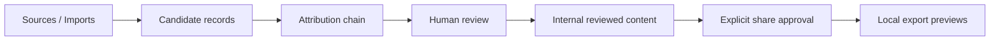

# LegoLens Core v3.0.0

**LegoLens Core** is a local-first, review-first intelligence workspace for collecting source material as candidates, preserving attribution, reviewing findings, and exporting controlled local previews.

Version **3.0.0** aligns the repository around a persistent local backend, a compact v3 browser interface, candidate-only ingestion, explicit review states, legacy import support, audit logging, backup/restore and local exports.

---

## Release status

- **Current release:** `v3.0.0`
- **Release type:** final local release
- **Runtime model:** local Node.js backend with static browser UI
- **Safety model:** review-first, candidate-only ingestion, explicit share approval

Core rule:

```text
No connector, import, sync or update may directly create approved content.
Everything enters as a candidate first.
```

Important distinction:

```text
reviewed != share_approved
```

---

## v3.0.0 architecture



Runtime files are generated locally under `runtime/`:

```text
runtime/ingestion_candidates.json
runtime/project_state.json
runtime/audit_log.json
runtime/legacy_import_log.json
```

The shared attribution chain is:

```text
Repository -> Case -> Source family -> Source -> Platform -> Narrative -> Item -> Review state
```

---

## Included in v3.0.0

- Persistent local candidate store.
- Persistent local project state.
- Audit trail for ingestion, review, import, backup and restore.
- `POST /api/ingestion/run-all` for all-case candidate-only source sync.
- Review states: `candidate`, `triaged`, `needs_evidence`, `linked_to_claim`, `reviewed`, `rejected`, `share_blocked`, `share_approved`.
- Legacy JSON import support for `items.json`, `sources.json`, `claims.json`, `evidence.json` and media manifests.
- Media/source records with source, platform, status, URL status and attribution chain.
- Local export previews for HTML, CSV, GeoJSON, STIX and MISP.
- Backend-only connector references; secrets are not exported.

---

## Case packs

The v3 registry includes:

- Iran
- Sudan
- Gaza Regional Spillover
- Ukraine Donbas
- Red Sea Yemen
- Sahel
- Demo Mode

---

## Main API endpoints

### Health and runtime

```text
GET  /api/health
GET  /api/project/state
POST /api/project/backup
POST /api/project/restore
GET  /api/audit
```

### Ingestion

```text
POST /api/ingestion/run
POST /api/ingestion/run-all
POST /api/ingestion/clear
GET  /api/ingestion/candidates
```

Example:

```http
POST /api/ingestion/run-all
Content-Type: application/json

{
  "limit_per_case": 40
}
```

### Review

```text
GET  /api/review/states
POST /api/review/update
```

### Legacy import

```text
POST /api/legacy/import
```

### Reports and exports

```text
GET /api/reports/export?case_id=iran&format=html
GET /api/reports/export?case_id=iran&format=csv
GET /api/reports/export?case_id=iran&format=geojson
GET /api/reports/export?case_id=iran&format=stix
GET /api/reports/export?case_id=iran&format=misp
```

---

## Start locally

Requirements:

- Node.js `>=20`
- npm

```bash
npm install
npm start
```

Open:

```text
http://localhost:8787
```

---

## Validation

```bash
node --check app_v3.js
node --check compat.js
node --check backend/server.mjs
npm test
npm run browser:smoke
npm run release:check
npm run ingestion:run-all
```

The release checks validate:

- v3.0.0 metadata.
- v3 browser entrypoint.
- Candidate-only all-case ingestion.
- Runtime candidate persistence.
- Review/share approval separation.
- Legacy import.
- HTML, CSV, GeoJSON, STIX-preview and MISP-preview exports.
- Export safety for secret-like values.

---

## Screenshots and interface guide

The v3.0 interface documentation is in:

- [v3.0 screenshot guide](docs/screenshots/v3_0/README.md)
- [Overview dashboard](docs/screenshots/v3_0/01-overview-dashboard.svg)
- [Content Updates and run-all ingestion](docs/screenshots/v3_0/02-content-updates-run-all.svg)
- [Media Library attribution view](docs/screenshots/v3_0/03-media-library-attribution.svg)

The SVG files are lightweight documentation mockups for GitHub. They are not large binary browser captures.

---

## Documentation

Important documents:

- `docs/RELEASE_NOTES_V3_FINAL.md`
- `docs/QC_REPORT_V3_FINAL.md`
- `docs/CONTENT_ACQUISITION_LAYER.md`
- `docs/EXTERNAL_STANDARDS_CONNECTORS_V2.md`
- `docs/INTELLIGENCE_QUALITY_v1_2.md`
- `docs/PUBLICATION_EXPLANATION_MULTILINGUAL.md`
- `docs/i18n/README.md`
- `docs/screenshots/v3_0/README.md`

---

## Responsible use

LegoLens is a review-first framework. Starter content, external imports and generated candidates are for triage and workflow testing. Do not publish or exchange findings externally without analyst review, corroboration and explicit sharing approval.

Sensitive claims, PII, casualty-related claims, allegations, visual evidence and vulnerable-location data require extra review before use or sharing.

---

## GitHub release checklist

Before tagging `v3.0.0`:

```bash
npm install
npm test
npm run browser:smoke
npm run release:check
npm run ingestion:run-all
```

Verify:

- `package.json` version is `3.0.0`.
- `data/version.json` release is `v3.0.0`.
- `index.html` loads `app_v3.js`.
- No runtime analyst data is committed.
- No connector secret, API key or private credential is committed.
