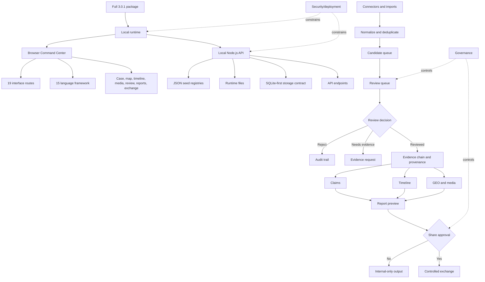
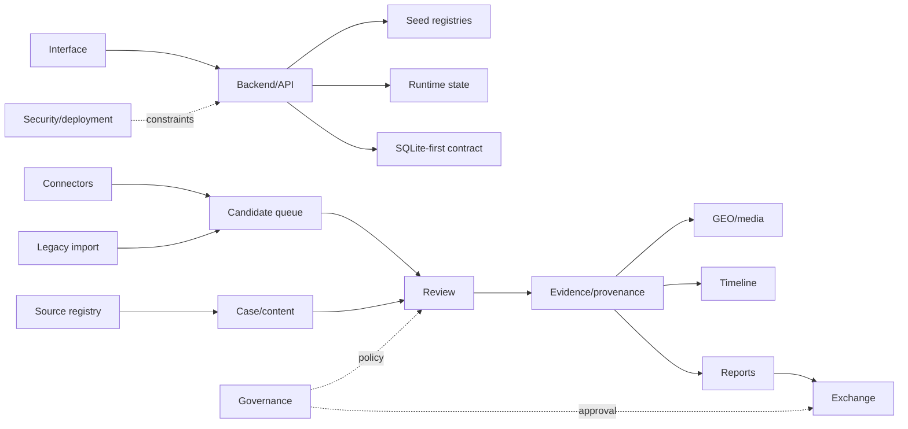
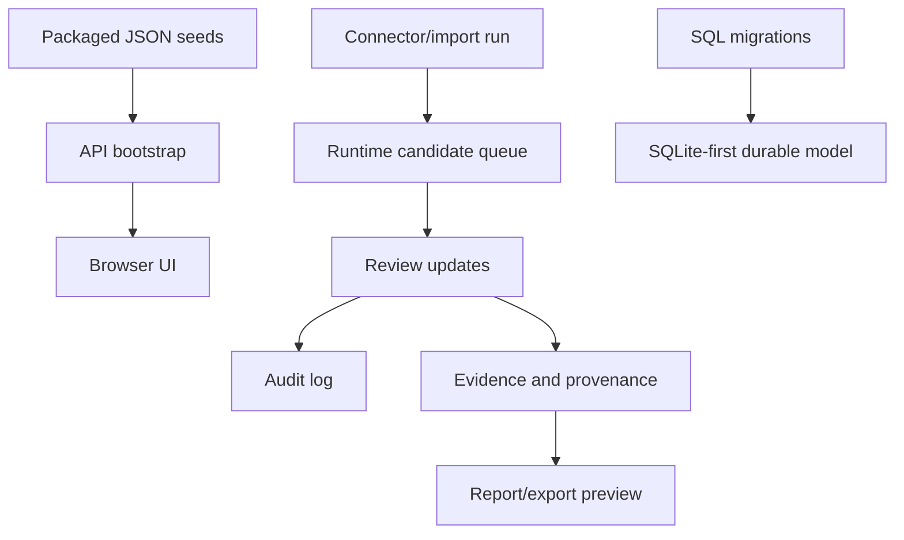
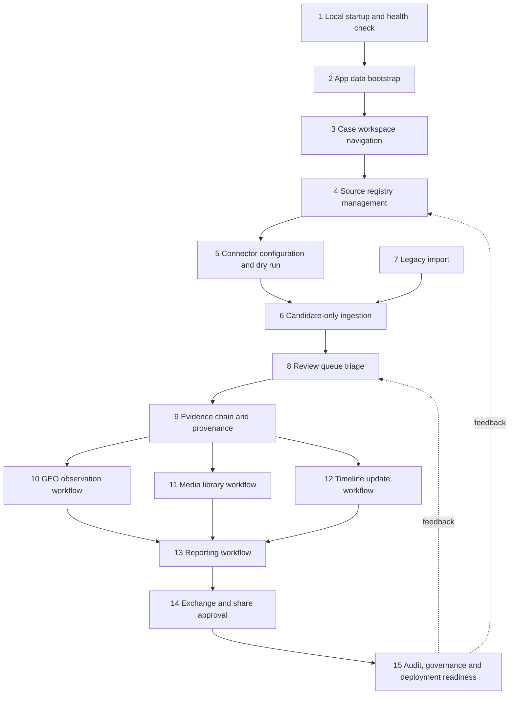
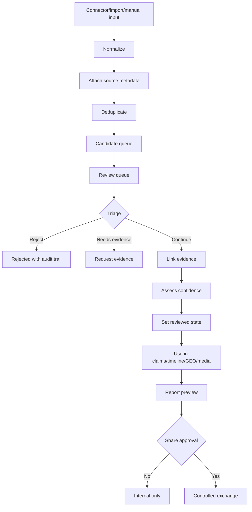

# LegoLens Core — Full 3.0.1 system documentation

`main` is the documentation branch for **LegoLens Core**. This README documents the Full 3.0.1 package as the canonical system description for the interface, cases, data, GEO, media assets, backend, storage, connectors, governance, review, reporting, exchange and multilingual support.

Source package:

```text
legolens_3_0_1_full_new_interface_no_tests.zip
```

The package itself is not uploaded to `main`. Runtime branches remain separate.

---

## Build facts

| Area | Value |
|---|---:|
| Release | LegoLens 3.0.1 Full |
| Package files | 338 |
| UI version | `3.0.1-full` |
| Entry point | `index.html` |
| Browser runtime | `app.js`, `app.css`, `ui-v301-command-center.css`, `compat.js` |
| Backend | `backend/server.mjs` |
| Case packs | 7 |
| Interface routes | 19 |
| Framework languages | 15 |
| Source records | 196 |
| Source families | 25 |
| Connector records | 21 |
| Social media platforms | 20 |
| GEO observations | 39 |
| GeoJSON features | 289 |
| Timeline updates | 21 |
| App report templates | 9 |
| Professional report templates | 7 |
| Asset manifest files | 216 |
| Database migrations | 3 |

---

## System purpose

LegoLens Core 3.0.1 Full is a local-first, review-first Command Center for case-based analysis work. It combines a static browser UI, a local Node.js API, JSON seed registries, a SQLite-first storage contract, connector adapters, review workflows, provenance, GEO/media assets and report generation.

The most important rule is:

```text
reviewed != share_approved
```

Material from connectors, imports, source sync, legacy files or manual updates enters as candidate material first. Review, evidence linking, confidence assessment and share approval are separate steps. A reviewed item can support internal case work, but it is not automatically approved for external exchange.

---

## Graphical system overview



---

## Architecture layers

A layer is a bounded responsibility area. It does not always mean a separate code package. Some layers are browser code, some are API routes, some are JSON registries and some are operating rules.

| Layer | Responsibility | Important artifacts | Boundary |
|---|---|---|---|
| Interface | Presents the Command Center and routes users through case work. | `index.html`, `app.js`, CSS files, 19 routes. | Displays and orchestrates; it does not decide what is true or shareable. |
| i18n | Provides multilingual orientation and LTR/RTL layout support. | 15 language framework entries. | Translates orientation and labels; system logic stays shared. |
| Case/content | Organizes cases, claims, reports, timelines and case-source links. | 7 case packs, claims, timeline updates, report references. | Structures context; claims still need evidence and review. |
| Source registry | Maintains source records, families, language and case links. | 196 sources, 25 source families, `/api/source-set`. | A source record is context, not automatic endorsement. |
| GEO/media | Adds map, observation, asset and preview context. | GEO observations, GeoJSON features, media library, thumbnails. | Visual context must stay tied to source and review state. |
| Backend/API | Serves local API endpoints, static UI and runtime writes. | `backend/server.mjs`, `/api/*`. | Local-first API; shared deployment needs extra controls. |
| Storage | Separates seed data, runtime state, import/export data and database direction. | JSON seeds, `runtime/*.json`, SQL migrations. | Analyst runtime files should not be committed to `main`. |
| Connectors | Describes and runs adapters for external or repository-like inputs. | Connector registry, connector health, ingestion endpoints. | Connector output is candidate-only. |
| Governance | Preserves source policy, decision logs, auditability and review rules. | Audit seed, checklists, decision log, governance records. | Governance controls transitions; it is not a source of evidence itself. |
| Review | Triage candidates, link evidence, assess confidence and update review state. | Review queue, `/api/review/states`, `/api/review/update`. | Review is separate from share approval. |
| Reporting/exchange | Generates local report previews and controlled exchange outputs. | Report templates, blueprints, export endpoint, exchange route. | External exchange requires explicit approval. |
| Security/deployment | Defines local-first safety and shared-deployment requirements. | Security headers, local runtime policy, deployment notes. | Production use requires auth, roles, secret handling and backups. |

### Interface layer

The interface is the analyst-facing Command Center. It gives access to dashboard, today view, datasets, case dashboard, map, timeline, monitor, investigation, graph statistics, frameworks, content updates, content, legacy import, media library, ingestion, review queue, reports, exchange and settings. Its role is to make the workflow visible and usable. It should keep candidate, reviewed and share approval states visibly separate.

### i18n layer

The i18n layer makes the framework usable in 15 languages and supports both LTR and RTL directions. It should not duplicate business logic per language. The same concepts apply in every language: candidate material enters first, review comes later, and share approval is a separate decision. The expanded language sections in this README are meant to give each language a real orientation rather than a shortened one-line card.

### Case/content layer

The case/content layer is the workspace structure. A case contains source links, claims, timelines, reports and related GEO/media context. This layer helps users keep analysis organized by case. It does not prove claims by itself. A claim shown inside a case still needs source context, evidence links, confidence assessment and review state.

### Source registry layer

The source registry is the catalog of sources and source families. It supports filtering, source family grouping, language context, case linking, connector mapping and report attribution. A source entry says that a source exists in the workspace and may be relevant; it does not say that every item from that source is correct or approved.

### GEO/media layer

The GEO/media layer connects maps, observations, GeoJSON features, thumbnails, previews and media assets to case work. It helps users understand spatial and visual context. Because maps and media can be persuasive, this layer must preserve attribution and review state. A visual item should not be separated from its source and provenance.

### Backend/API layer

The backend is the local Node.js service in `backend/server.mjs`. It serves the static UI, exposes API endpoints, returns seed registries and writes local runtime state. It is local-first. If the system is deployed for shared use, extra authentication, role control, secret isolation, backup and retention policies are required.

### Storage layer

The storage layer separates packaged seed/reference data from runtime state. Runtime state includes candidate queues, audit logs and legacy import logs. These files belong to local operation and should not be committed as documentation. SQL migrations define the SQLite-first direction for durable storage.

### Connectors layer

Connectors fetch or prepare material from configured inputs such as web, RSS, Telegram, social media or static repositories. A connector can normalize and deduplicate material, but it cannot approve it. The output of the connector layer is candidate material only.

### Governance layer

Governance defines the operating rules around source use, claim handling, decisions and auditability. It exists so that important transitions are not silent. Rejections, review updates, report use and exchange decisions should remain explainable through logs, checklists or decision records.

### Review layer

The review layer is the central quality boundary. Candidates are triaged, rejected, held for more evidence, linked to claims or moved forward as reviewed material. The review layer must keep this chain clear:

```text
candidate -> reviewed -> share_approved
```

These states are intentionally separate.

### Reporting/exchange layer

The reporting layer creates local previews from reviewed case material, evidence chains, timelines, GEO context and media references. Exchange is stricter: it is the controlled external-output layer and requires explicit share approval. A report preview can support internal review without being approved for exchange.

### Security/deployment layer

The default model is local use. Shared deployment is a separate operational decision. Before shared deployment, the system needs authentication, authorization, role boundaries, secret isolation, connector credential handling, CORS review, backups, retention policy and export governance.

---

## Layer interaction diagram



Interaction rules:

1. The interface displays state; it should not hide state transitions.
2. Connectors and imports create candidates, not approved evidence.
3. Source records provide context, not automatic trust.
4. Claims, timelines, GEO and media should stay linked to evidence and provenance.
5. Reports can be internal previews; exchange requires explicit share approval.
6. Governance and audit should travel with decisions, not be added afterwards.

---

## API surface

```text
GET  /api/health
GET  /api/version
GET  /api/app-data
GET  /api/source-set
GET  /api/schema
GET  /api/ingestion/candidates
POST /api/ingestion/clear
POST /api/ingestion/run
GET  /api/review/states
POST /api/review/update
POST /api/legacy/import
GET  /api/reports/export
GET  /api/workflow/config
GET  /api/audit/seed
GET  /api/reports/blueprints
GET  /api/evidence/chains
GET  /api/geo/layers
GET  /api/reports/templates-v39
GET  /api/team/review
GET  /api/team/checklists
GET  /api/team/decision-log
GET  /api/evidence/claim-clusters
GET  /api/evidence/provenance-graph
GET  /api/evidence/conflict-flags
GET  /api/connectors/registry
GET  /api/connectors/health
GET  /api/storage/status
```

---

## Storage model

Runtime files are local and should not be committed as analyst data:

```text
runtime/ingestion_candidates.json
runtime/audit_log.json
runtime/legacy_import_log.json
```

Database migrations define the SQLite-first direction:

```text
database/migrations/001_init.sql
database/migrations/002_storage_state_indexes.sql
database/migrations/003_v47_database_first.sql
```



---

## Case packs

| Case | Role | Sources | Claims | Reports | Confidence |
|---|---|---:|---:|---:|---:|
| Iran | Nuclear/social-source monitoring | 30 | 8 | 8 | 67 |
| Sudan | Humanitarian-conflict monitoring | 18 | 12 | 0 | 66 |
| Gaza Regional Spillover | Regional spillover and source landscape | 18 | 12 | 0 | 67 |
| Ukraine Donbas | OSINT, map and civil-society sources | 19 | 12 | 0 | 66 |
| Red Sea Yemen | Maritime, shipping and Yemen context | 18 | 12 | 0 | 67 |
| Sahel | Instability, humanitarian and disinformation sources | 18 | 12 | 0 | 65 |
| Demo Mode | Demonstration workspace | 1 | 0 | 0 | 87 |

Case packs are workspace containers. They connect sources, claims, reports, timelines, GEO context and media context. A case pack keeps material organized, but it does not replace review.

---

## Interface routes

```text
dashboard, today, datasets, case-dashboard, map, timeline, monitor,
investigate, graph-stats, frameworks, content-updates, content,
legacy-import, media-library, ingestion, review-queue, reports,
exchange, settings
```

The route set mirrors the workflow: start with dashboards, move into cases and sources, inspect maps/timelines/media, run ingestion/import, review candidates, generate reports and only then move to controlled exchange.

---

## System workflows

The workflows below are documented as both diagrams and descriptions. The diagrams show the control flow. The descriptions explain why each step exists.

### Workflow map



### Candidate, review and exchange workflow



### Workflow descriptions

| # | Workflow | Expanded description |
|---:|---|---|
| 1 | Local startup and health check | Unpack the Full 3.0.1 package, install dependencies, start the local backend and verify that `/api/health` and `/api/version` respond correctly. This proves that the local API and UI are available before analysis starts. |
| 2 | App data bootstrap | The browser loads routes, languages, case packs, sources, workflow configuration and report metadata from local API/JSON seeds. This turns the static UI into a case-aware Command Center. |
| 3 | Case workspace navigation | The user selects a case and moves between claims, sources, timeline, map, media and reports. The purpose is to keep work tied to a case context instead of mixing unrelated material. |
| 4 | Source registry management | Source records and families are maintained with language, status and case links. The registry supports attribution and filtering, but a source record is not automatic proof. |
| 5 | Connector configuration and dry run | Connector records and health checks are inspected before use. A dry run confirms that an adapter can normalize input without treating the result as reviewed or approved. |
| 6 | Candidate-only ingestion | Connector or import output is normalized, attributed and deduplicated into the candidate queue. This is intentionally separate from reviewed evidence. |
| 7 | Legacy import | Older JSON material is mapped into the current workflow with traceability. Legacy import should preserve origin and mapping assumptions instead of silently merging old data as accepted evidence. |
| 8 | Review queue triage | Candidates are inspected by a reviewer. They can be rejected, held for more evidence, linked to claims or moved forward as reviewed material. The decision should remain auditable. |
| 9 | Evidence chain and provenance | Reviewed material is connected to source, candidate, review state, case use and report context. Provenance prevents unsupported claims from appearing in reports. |
| 10 | GEO observation workflow | Spatial observations and GeoJSON features are connected to case context and map views. Map display is context, not proof by itself. |
| 11 | Media library workflow | Media assets, thumbnails and previews remain tied to source metadata, case links and review state. Visual assets should not be detached from provenance. |
| 12 | Timeline update workflow | Dated updates are connected to case chronology, sources and evidence. Timeline entries should distinguish source reports, observed events and analyst interpretation. |
| 13 | Reporting workflow | Local report previews are generated from reviewed records, evidence chains, timeline entries, GEO context and media references. Reporting supports internal synthesis first. |
| 14 | Exchange and share approval | External exchange is a separate decision stage. A report can be internally reviewed without being share-approved. This enforces `reviewed != share_approved`. |
| 15 | Audit, governance and deployment readiness | Audit logs, decision logs, review states and deployment requirements are checked. Shared deployment needs authentication, roles, secret isolation, backups and retention rules. |

---

## Supported languages

Each language block is intentionally longer than a compact label card. The goal is to preserve the full concept in every language: local-first operation, candidate-only ingestion, review-first handling, evidence/provenance, reporting and separate share approval.

| Code | Language | Direction |
|---|---|---|
| nl | Nederlands | LTR |
| en | English | LTR |
| fa | فارسی | RTL |
| ar | العربية | RTL |
| fr | Français | LTR |
| de | Deutsch | LTR |
| es | Español | LTR |
| tr | Türkçe | LTR |
| ru | Русский | LTR |
| ur | اردو | RTL |
| zh | 中文 | LTR |
| hi | हिन्दी | LTR |
| pt | Português | LTR |
| id | Bahasa Indonesia | LTR |
| ja | 日本語 | LTR |

<details><summary>nl — Nederlands</summary>

LegoLens Core 3.0.1 Full is een lokale, review-first Command Center workspace voor casusonderzoek, bronnen, GEO, media, rapportage en gecontroleerde uitwisseling.

Nieuwe informatie komt eerst binnen als candidate. Daarna volgen triage, bron- en bewijslinking, confidence assessment en review. Pas daarna kan materiaal intern gebruikt worden in claims, tijdlijnen, kaarten, media-overzichten of rapporten.

De kernregel blijft: `reviewed != share_approved`. Intern beoordeeld materiaal is dus niet automatisch goedgekeurd voor externe exchange. De lagen interface, i18n, case/content, source registry, GEO/media, backend/API, storage, connectors, governance, review, reporting/exchange en security/deployment bewaken samen deze scheiding.

</details>

<details><summary>en — English</summary>

LegoLens Core 3.0.1 Full is a local-first, review-first Command Center workspace for cases, sources, GEO, media, reporting and controlled exchange.

New material enters as a candidate first. It then moves through triage, source and evidence linking, confidence assessment and review. Only after that can material support internal claims, timelines, maps, media views or reports.

The core rule remains: `reviewed != share_approved`. Internally reviewed material is not automatically approved for external exchange. The interface, i18n, case/content, source registry, GEO/media, backend/API, storage, connectors, governance, review, reporting/exchange and security/deployment layers preserve this separation.

</details>

<details><summary>fa — فارسی</summary>
<div dir="rtl">

LegoLens Core 3.0.1 Full یک محیط محلی و review-first برای پرونده‌ها، منابع، GEO، رسانه، گزارش‌دهی و تبادل کنترل‌شده است.

هر دادهٔ تازه ابتدا به‌عنوان candidate وارد می‌شود. سپس triage، اتصال به منبع و شواهد، ارزیابی confidence و review انجام می‌شود. بعد از این مراحل، ماده می‌تواند برای استفادهٔ داخلی در claims، timelines، maps، media views یا reports به کار رود.

قاعدهٔ اصلی باقی می‌ماند: `reviewed != share_approved`. ماده‌ای که برای استفادهٔ داخلی review شده، به‌صورت خودکار برای exchange بیرونی تأیید نشده است. لایه‌های interface، i18n، case/content، source registry، GEO/media، backend/API، storage، connectors، governance، review، reporting/exchange و security/deployment این جداسازی را حفظ می‌کنند.

</div>
</details>

<details><summary>ar — العربية</summary>
<div dir="rtl">

LegoLens Core 3.0.1 Full هو فضاء Command Center محلي قائم على review-first للقضايا والمصادر وGEO والوسائط والتقارير والتبادل المنضبط.

كل مادة جديدة تدخل أولاً كـ candidate. بعد ذلك تمر عبر triage، وربط المصدر والأدلة، وتقييم confidence، ثم review. بعد هذه المراحل فقط يمكن استخدامها داخلياً في claims أو timelines أو maps أو media views أو reports.

تبقى القاعدة الأساسية: `reviewed != share_approved`. المادة التي تمت مراجعتها داخلياً ليست تلقائياً معتمدة للتبادل الخارجي. طبقات interface وi18n وcase/content وsource registry وGEO/media وbackend/API وstorage وconnectors وgovernance وreview وreporting/exchange وsecurity/deployment تحفظ هذا الفصل.

</div>
</details>

<details><summary>fr — Français</summary>

LegoLens Core 3.0.1 Full est un espace Command Center local-first et review-first pour les cas, les sources, le GEO, les médias, les rapports et les échanges contrôlés.

Toute nouvelle matière entre d’abord comme candidate. Elle passe ensuite par la triage, le rattachement aux sources et aux preuves, l’évaluation de confiance et la revue. Après cela seulement, elle peut soutenir des claims, timelines, cartes, vues médias ou rapports internes.

La règle centrale demeure : `reviewed != share_approved`. Un contenu revu en interne n’est pas automatiquement approuvé pour un échange externe. Les couches interface, i18n, case/content, source registry, GEO/media, backend/API, storage, connectors, governance, review, reporting/exchange et security/deployment préservent cette séparation.

</details>

<details><summary>de — Deutsch</summary>

LegoLens Core 3.0.1 Full ist ein lokaler review-first Command-Center-Arbeitsbereich für Fälle, Quellen, GEO, Medien, Berichte und kontrollierten Austausch.

Neue Inhalte gelangen zuerst als Candidate in das System. Danach folgen Triage, Quellen- und Evidenzverknüpfung, Confidence Assessment und Review. Erst danach kann Material intern in Claims, Timelines, Karten, Medienansichten oder Reports verwendet werden.

Die zentrale Regel bleibt: `reviewed != share_approved`. Intern geprüftes Material ist nicht automatisch für externen Exchange freigegeben. Die Schichten Interface, i18n, Case/Content, Source Registry, GEO/Media, Backend/API, Storage, Connectors, Governance, Review, Reporting/Exchange und Security/Deployment sichern diese Trennung.

</details>

<details><summary>es — Español</summary>

LegoLens Core 3.0.1 Full es un Command Center local-first y review-first para casos, fuentes, GEO, medios, informes e intercambio controlado.

Todo material nuevo entra primero como candidate. Después pasa por triage, vinculación con fuentes y evidencia, evaluación de confianza y review. Solo entonces puede apoyar claims, timelines, mapas, vistas de medios o informes internos.

La regla central sigue siendo: `reviewed != share_approved`. El material revisado internamente no queda aprobado automáticamente para exchange externo. Las capas interface, i18n, case/content, source registry, GEO/media, backend/API, storage, connectors, governance, review, reporting/exchange y security/deployment preservan esta separación.

</details>

<details><summary>tr — Türkçe</summary>

LegoLens Core 3.0.1 Full vakalar, kaynaklar, GEO, medya, raporlama ve kontrollü paylaşım için yerel ve review-first bir Command Center alanıdır.

Yeni materyal önce candidate olarak sisteme girer. Ardından triage, source/evidence linking, confidence assessment ve review adımlarından geçer. Bundan sonra materyal iç kullanımda claims, timelines, maps, media views veya reports için kullanılabilir.

Temel kural aynıdır: `reviewed != share_approved`. İç kullanım için reviewed olan materyal dış exchange için otomatik onaylanmış sayılmaz. Interface, i18n, case/content, source registry, GEO/media, backend/API, storage, connectors, governance, review, reporting/exchange ve security/deployment katmanları bu ayrımı korur.

</details>

<details><summary>ru — Русский</summary>

LegoLens Core 3.0.1 Full — локальный review-first Command Center для кейсов, источников, GEO, медиа, отчетности и контролируемого обмена.

Новый материал сначала поступает как candidate. Затем он проходит triage, привязку к источникам и доказательствам, оценку confidence и review. Только после этого он может использоваться внутри в claims, timelines, maps, media views или reports.

Основное правило остается: `reviewed != share_approved`. Материал, проверенный для внутреннего использования, не получает автоматическое разрешение на внешний exchange. Слои interface, i18n, case/content, source registry, GEO/media, backend/API, storage, connectors, governance, review, reporting/exchange и security/deployment сохраняют это разделение.

</details>

<details><summary>ur — اردو</summary>
<div dir="rtl">

LegoLens Core 3.0.1 Full کیسز، sources، GEO، media، reporting اور controlled exchange کے لیے local-first اور review-first Command Center workspace ہے۔

نیا material پہلے candidate کے طور پر داخل ہوتا ہے۔ اس کے بعد triage، source اور evidence linking، confidence assessment اور review ہوتی ہے۔ اس کے بعد ہی material اندرونی claims، timelines، maps، media views یا reports میں استعمال ہو سکتا ہے۔

بنیادی اصول یہی ہے: `reviewed != share_approved`۔ اندرونی استعمال کے لیے reviewed material external exchange کے لیے خودکار طور پر approved نہیں ہوتا۔ Interface، i18n، case/content، source registry، GEO/media، backend/API، storage، connectors، governance، review، reporting/exchange اور security/deployment layers اس separation کو برقرار رکھتے ہیں۔

</div>
</details>

<details><summary>zh — 中文</summary>

LegoLens Core 3.0.1 Full 是用于案例、来源、GEO、媒体、报告和受控交换的本地优先、审核优先 Command Center。

所有新材料首先作为 candidate 进入系统。随后经过 triage、来源与证据链接、confidence assessment 和 review。之后，材料才可以在内部 claims、timelines、maps、media views 或 reports 中使用。

核心规则仍然是：`reviewed != share_approved`。内部 reviewed 的材料不会自动获得外部 exchange 批准。interface、i18n、case/content、source registry、GEO/media、backend/API、storage、connectors、governance、review、reporting/exchange 和 security/deployment 层共同保持这种分离。

</details>

<details><summary>hi — हिन्दी</summary>

LegoLens Core 3.0.1 Full cases, sources, GEO, media, reporting और controlled exchange के लिए local-first, review-first Command Center है।

नया material पहले candidate के रूप में आता है। इसके बाद triage, source और evidence linking, confidence assessment और review होते हैं। तभी material internal claims, timelines, maps, media views या reports में उपयोग हो सकता है।

मुख्य नियम है: `reviewed != share_approved`। Internal use के लिए reviewed material external exchange के लिए automatic approved नहीं होता। Interface, i18n, case/content, source registry, GEO/media, backend/API, storage, connectors, governance, review, reporting/exchange और security/deployment layers इस separation को बनाए रखते हैं।

</details>

<details><summary>pt — Português</summary>

LegoLens Core 3.0.1 Full é um Command Center local-first e review-first para casos, fontes, GEO, mídia, relatórios e troca controlada.

Todo material novo entra primeiro como candidate. Depois passa por triage, ligação a fontes e evidências, avaliação de confiança e review. Só então pode apoiar claims, timelines, mapas, media views ou reports internos.

A regra central permanece: `reviewed != share_approved`. Material revisado internamente não é aprovado automaticamente para exchange externo. As camadas interface, i18n, case/content, source registry, GEO/media, backend/API, storage, connectors, governance, review, reporting/exchange e security/deployment preservam essa separação.

</details>

<details><summary>id — Bahasa Indonesia</summary>

LegoLens Core 3.0.1 Full adalah Command Center local-first dan review-first untuk kasus, sumber, GEO, media, pelaporan dan pertukaran terkontrol.

Materi baru selalu masuk terlebih dahulu sebagai candidate. Setelah itu materi melewati triage, pengaitan source dan evidence, confidence assessment dan review. Baru setelah itu materi dapat digunakan secara internal dalam claims, timelines, maps, media views atau reports.

Aturan inti tetap: `reviewed != share_approved`. Materi yang sudah reviewed untuk penggunaan internal tidak otomatis approved untuk exchange eksternal. Layer interface, i18n, case/content, source registry, GEO/media, backend/API, storage, connectors, governance, review, reporting/exchange dan security/deployment menjaga pemisahan ini.

</details>

<details><summary>ja — 日本語</summary>

LegoLens Core 3.0.1 Full は、ケース、ソース、GEO、メディア、レポート、管理された交換のための local-first / review-first Command Center です。

新しい素材はまず candidate として入ります。その後、triage、source/evidence linking、confidence assessment、review を通ります。そこで初めて、内部の claims、timelines、maps、media views、reports に使うことができます。

中心ルールは `reviewed != share_approved` です。内部利用のために reviewed された素材は、外部 exchange に自動承認されたわけではありません。interface、i18n、case/content、source registry、GEO/media、backend/API、storage、connectors、governance、review、reporting/exchange、security/deployment の各レイヤーがこの分離を維持します。

</details>

---

## Local runtime

After unpacking the Full 3.0.1 package locally:

```bash
npm install
npm start
```

Open:

```text
http://localhost:8787
```

Validation:

```bash
npm test
```

---

## Branch model

- `main` — documentation and publication explanation for Full 3.0.1.
- `3.0.1` — lightweight runtime branch for quick local evaluation.
- `legolens-v3.0.1-runtime` — earlier/full-runtime context layer.
- `archive/3.0.0` — previous 3.0.0 baseline.

`main` should not contain the uploaded zip, active runtime files, test logs or generated analyst data.

---

## README maintenance rules

- Keep the graphical Mermaid workflows in the README.
- Keep the architecture layers expanded with responsibilities and boundaries.
- Do not reduce the individual language sections back to one-line summaries.
- Keep `reviewed != share_approved` visible in system, review and exchange sections.
- Keep connector output documented as candidate-only.
- Keep runtime analyst data out of `main`.
