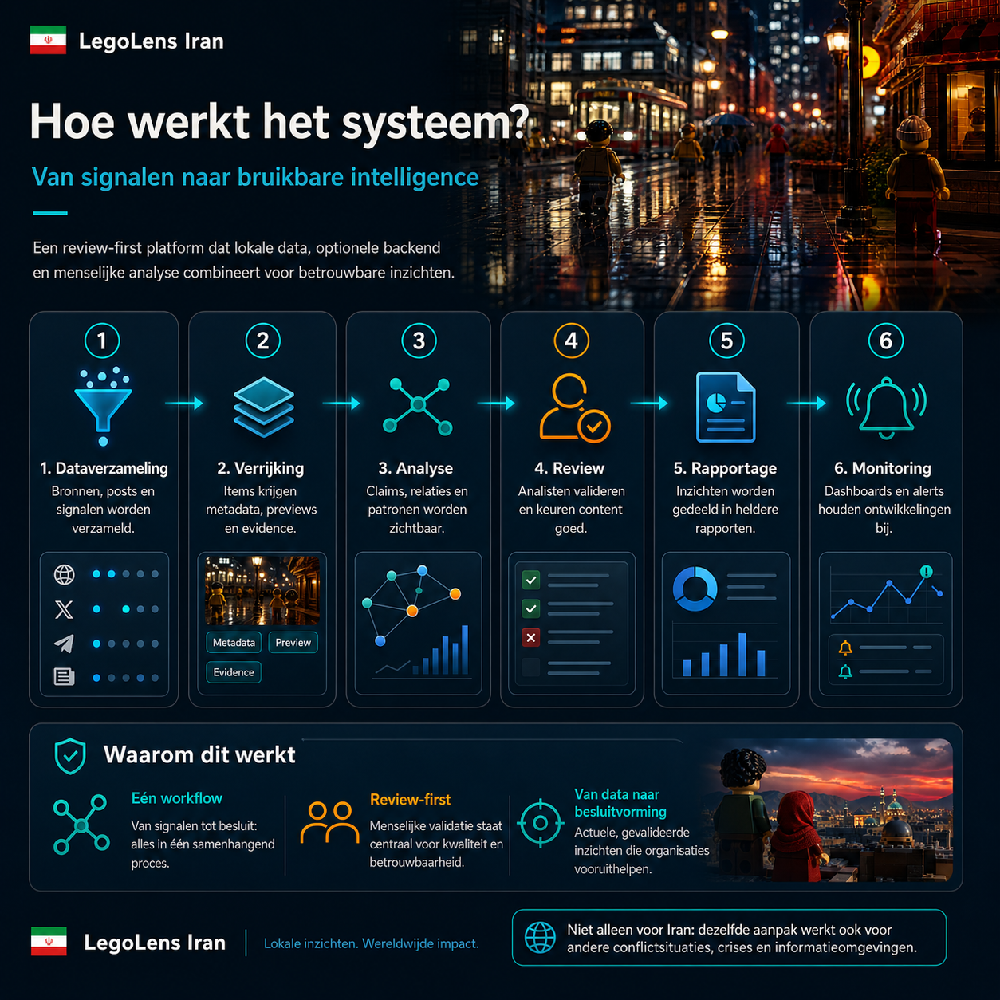
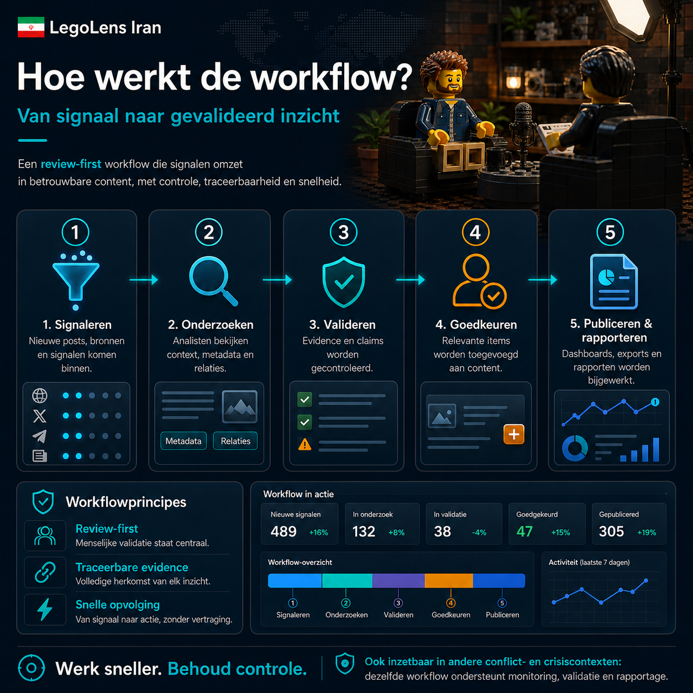
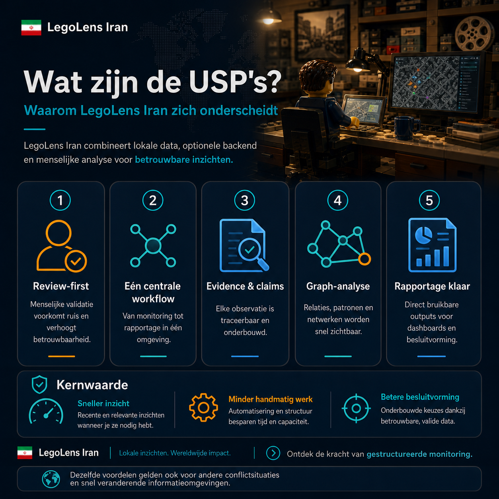
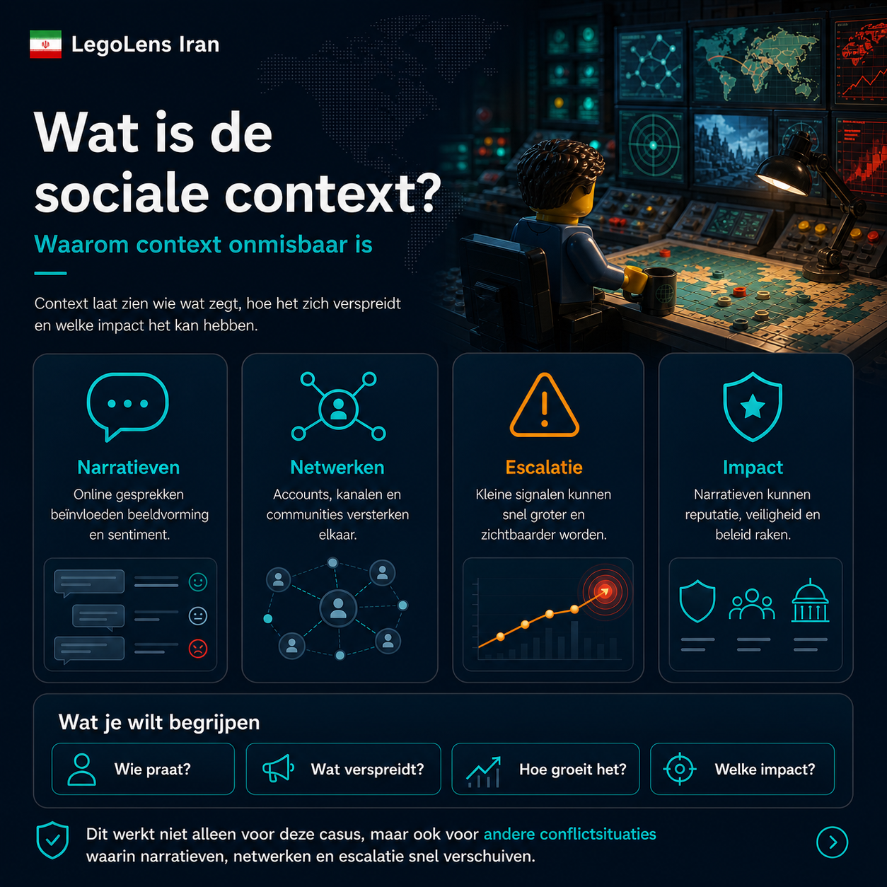
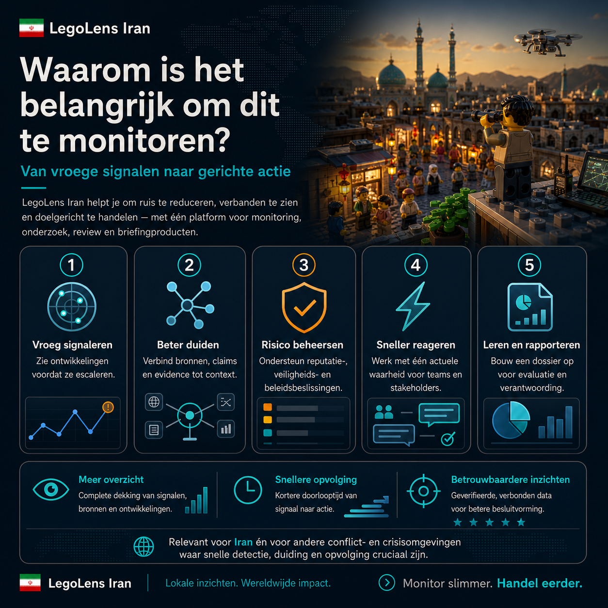

# LegoLens Core v1.0 + Iran Case Pack

**LegoLens** is een open-source, review-first intelligence framework voor het monitoren van complexe informatieomgevingen. Het helpt teams om signalen, bronnen, claims, evidence, netwerken en rapportage samen te brengen in één traceerbare workflow.

**LegoLens Iran** is de eerste meegeleverde case pack. De Iran-casus demonstreert het framework, maar de methode is case-agnostisch en inzetbaar in andere conflict-, crisis- en snel veranderende informatieomgevingen.



## Waarom dit project bestaat

Online informatieomgevingen veranderen snel. Losse posts, bronnen, claims en beelden worden pas bruikbaar wanneer ze in context worden geplaatst, gevalideerd en traceerbaar gerapporteerd. LegoLens biedt daarvoor een gestructureerde analyst workflow: van eerste signaal tot evidence-backed rapport.

## Wat zit er in deze v1.0 release?

| Onderdeel | Status |
|---|---|
| LegoLens Core framework | Stable v1.0 |
| Iran case pack | Bundled v1.0 |
| Offline/static app | Ja, open `index.html` |
| Optionele backend | Ja, `node backend/server.mjs` |
| Review-first approval-flow | Ja |
| Evidence- en confidence-model | Ja |
| Graph Explorer | Ja |
| Report Builder | Ja |
| Community docs | Ja |
| GitHub + ChatGPT handleiding | Ja |
| Release gate + checksums | Ja |

## Screenshots

### Systeemoverzicht


### Workflow



### USP's



### Sociale context



### Monitoringwaarde



## Data snapshot

| Entity | Count |
|---|---:|
| Content items | 476 |
| Sources | 382 |
| Source families | 10 |
| Evidence records | 476 |
| Claims | 14 |
| Incidents | 6 |

## Snel starten

```bash
# 1. Pak de ZIP uit
unzip legolens_core_v1_0_bundle.zip
cd legolens_core_v1_0

# 2. Offline/static gebruiken
open index.html

# 3. Optionele backend gebruiken
node backend/server.mjs
# open http://localhost:8787

# 4. Valideren
npm run build
npm run validate
npm test
```

## Kernprincipes

1. **Review-first:** niets wordt direct gepubliceerd zonder menselijke beoordeling.
2. **Evidence-based:** observaties worden gekoppeld aan bronnen, previews, metadata en evidence.
3. **Traceerbaar:** beslissingen, imports en approvals moeten auditbaar zijn.
4. **Case-agnostisch:** Iran is een case pack; het framework is breder inzetbaar.
5. **Local-first:** de app werkt offline en kan optioneel met een backend draaien.
6. **Veilige defaults:** API-sleutels horen server-side, niet in de browser.

## Documentatie

- [Projectomschrijving](docs/PROJECT_OVERVIEW.md)
- [Volledige systeem uitleg](docs/SYSTEM_EXPLANATION.md)
- [Architectuur](docs/ARCHITECTURE.md)
- [Data model](docs/DATA_MODEL.md)
- [Case pack guide](docs/CASE_PACK_GUIDE.md)
- [Operating manual](docs/OPERATING_MANUAL.md)
- [GitHub push + ChatGPT koppeling](docs/GITHUB_AND_CHATGPT_GUIDE.md)
- [Security model](docs/SECURITY_MODEL.md)
- [Responsible use](RESPONSIBLE_USE.md)
- [Contributing](CONTRIBUTING.md)

## Breder dan één casus

LegoLens werkt niet alleen voor Iran. Het framework is ontworpen voor situaties waar dezelfde vragen terugkomen:

- welke signalen ontstaan?
- welke claims circuleren?
- welke bronnen versterken elkaar?
- welke netwerken en narratieven groeien?
- welke evidence is betrouwbaar genoeg?
- wat moet worden gerapporteerd en wat blijft onzeker?

Daarom is LegoLens toepasbaar op conflictmonitoring, crisisrespons, humanitaire monitoring, informatie-incidenten, narrative tracking, factchecking workflows en andere dynamische contexten.

## Release status

Deze bundel is gegenereerd als **LegoLens Core v1.0.0 Stable Community Release**. Zie `RELEASE_REPORT_v1_0.md` en `checksums.sha256`.
