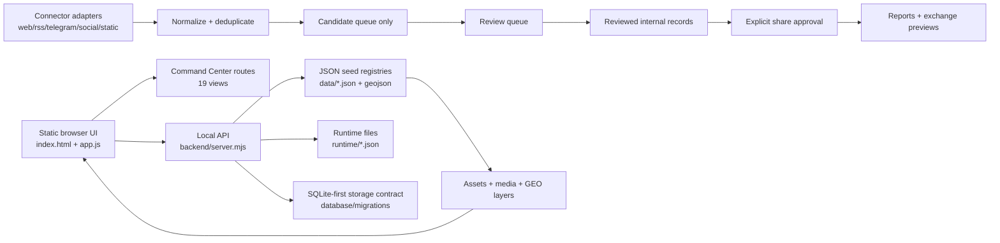

# LegoLens Core — Full 3.0.1 multilingual documentation

`main` is the documentation branch for **LegoLens Core**. This README documents the attached Full 3.0.1 package, including the complete interface, case model, backend/API, storage, connectors, governance, provenance, reporting, assets and internationalization layer.

Source package used for this documentation:

```text
legolens_3_0_1_full_new_interface_no_tests.zip
```

The package itself is **not** uploaded to `main`. This branch contains documentation only. Runtime branches and generated analyst/runtime data remain separate.

---

## Build facts

| Area | Value |
|---|---:|
| Release | LegoLens 3.0.1 Full |
| Package files | 338 |
| Version | `3.0.1` |
| UI version | `3.0.1-full` |
| Official entrypoint | `index.html` |
| Browser runtime | `app.js`, `app.css`, `ui-v301-command-center.css`, `compat.js` |
| Backend start script | `node backend/server.mjs` |
| Case packs | 7 |
| Interface routes | 19 |
| Framework languages | 15 |
| Source records | 196 |
| Source families | 25 |
| Connector records | 21 |
| Connector adapter classes | web, RSS, Telegram, social, static repository |
| Social media platforms | 20 |
| GEO observations | 39 |
| GeoJSON features | 289 |
| Timeline updates | 21 |
| App report templates | 9 |
| Professional report templates | 7 |
| Asset manifest files | 216 |
| Database migrations | 3 |
| Review queue items | 7 |
| Review status model | 7 states |

---

## Full system architecture

LegoLens 3.0.1 Full is a local-first, review-first intelligence workspace. It combines a static browser Command Center, a local Node.js backend, JSON seed registries, a database-first storage contract, connector adapters, review workflows, report generation and media/GEO assets. The system is designed so that imported or synchronized material always enters as a candidate, never as approved publishable content.



### Architectural layers

1. **Interface layer** — `index.html` loads the v3.0.1 Full Command Center through `app.js` and the active CSS set. The UI exposes 19 routes grouped around overview, analysis, content, review, reports, exchange and administration.
2. **Internationalization layer** — the framework supports 15 languages and both LTR/RTL direction. Arabic, Farsi and Urdu require RTL-aware rendering.
3. **Case and content layer** — `data/app_data.json` defines the route list, language list, case packs, case metadata, claims, report counts and case-source links.
4. **Source registry layer** — `data/source_set.json` contains 196 source records, 25 source families and connector metadata. Source records are linked to case IDs and include status, language, review, URL, reliability and risk policy metadata.
5. **GEO and media layer** — `data/geo_layers.geojson`, case maps, previews, leader slides, case photos, thumbnails and asset manifests provide the map/observation/media context used in the Command Center.
6. **Backend/API layer** — `backend/server.mjs` serves static files, applies security headers, exposes API endpoints, writes runtime JSON atomically and enforces candidate-only ingestion and review state validation.
7. **Storage layer** — Full 3.0.1 is database-first by contract. SQLite is the primary store; JSON files are seed/import/export snapshots. The storage manifest defines tables for cases, sources, evidence chains, audit log, review tasks, case state, source verification and runtime candidates.
8. **Connector layer** — connector adapters are present for web, RSS, Telegram, social and static repository sources. The adapter contract is configure, test connection, dry run, normalize, deduplicate, write candidate only and log errors.
9. **Governance/provenance layer** — governance files define source status, deduplication rules, claim governance, evidence chains, provenance graph, conflict flags, decision logs and audit requirements.
10. **Review workflow layer** — candidates move through explicit review states. Review does not equal share approval. Publication or exchange requires separate approval.
11. **Reporting/exchange layer** — report blueprints, professional templates and export endpoints provide local previews for structured reporting, visual appendices and exchange formats.
12. **Security/deployment layer** — local use is supported directly. Shared deployment requires auth, roles, hardened Docker settings, secrets outside the frontend/image, SBOM and signed releases.

### Backend API surface

The local backend exposes the following documented endpoints:

```text
GET  /api/health
GET  /api/version
GET  /api/app-data
GET  /api/source-set
GET  /api/schema
GET  /api/ingestion/candidates
POST /api/ingestion/clear
POST /api/ingestion/run
GET  /api/review/states
POST /api/review/update
POST /api/legacy/import
GET  /api/reports/export
GET  /api/workflow/config
GET  /api/audit/seed
GET  /api/reports/blueprints
GET  /api/evidence/chains
GET  /api/geo/layers
GET  /api/reports/templates-v39
GET  /api/team/review
GET  /api/team/checklists
GET  /api/team/decision-log
GET  /api/evidence/claim-clusters
GET  /api/evidence/provenance-graph
GET  /api/evidence/conflict-flags
GET  /api/connectors/registry
GET  /api/connectors/health
GET  /api/storage/status
```

### Runtime and storage model

Runtime data is local and generated at run time. It must not be committed as analyst data.

```text
runtime/ingestion_candidates.json
runtime/audit_log.json
runtime/legacy_import_log.json
```

The database-first contract defines SQLite as the primary store with migrations:

```text
database/migrations/001_init.sql
database/migrations/002_storage_state_indexes.sql
database/migrations/003_v47_database_first.sql
```

JSON registries remain important as deterministic seeds, import/export snapshots and documentation artifacts.

### Review-first rule

```text
reviewed != share_approved
```

Connectors, imports, syncs and updates may not create approved content directly. They write to the candidate queue. Analysts review, classify, corroborate and then explicitly decide whether an item is share approved, share blocked or rejected.

---

## Case packs

| Case | Region / role | Sources in case pack | Claims | Reports | Confidence |
|---|---|---:|---:|---:|---:|
| Iran | Tehran Province | 30 | 8 | 8 | 67 |
| Sudan | Africa / humanitarian-conflict monitoring | 18 | 12 | 0 | 66 |
| Gaza Regional Spillover | Eastern Mediterranean / regional spillover | 18 | 12 | 0 | 67 |
| Ukraine Donbas | Europe / OSINT-map context | 19 | 12 | 0 | 66 |
| Red Sea Yemen | Maritime / Red Sea risk | 18 | 12 | 0 | 67 |
| Sahel | Africa / instability and disinformation | 18 | 12 | 0 | 65 |
| Demo Mode | Demonstration workspace | 1 | 0 | 0 | 87 |

---

## Interface routes

```text
dashboard, today, datasets, case-dashboard, map, timeline, monitor,
investigate, graph-stats, frameworks, content-updates, content,
legacy-import, media-library, ingestion, review-queue, reports,
exchange, settings
```

---

## Supported framework languages

| Code | Language | Direction |
|---|---|---|
| nl | Nederlands | LTR |
| en | English | LTR |
| fa | فارسی | RTL |
| ar | العربية | RTL |
| fr | Français | LTR |
| de | Deutsch | LTR |
| es | Español | LTR |
| tr | Türkçe | LTR |
| ru | Русский | LTR |
| ur | اردو | RTL |
| zh | 中文 | LTR |
| hi | हिन्दी | LTR |
| pt | Português | LTR |
| id | Bahasa Indonesia | LTR |
| ja | 日本語 | LTR |

---

## Local runtime

Use this only after unpacking the Full 3.0.1 package locally:

```bash
npm install
npm start
```

Open:

```text
http://localhost:8787
```

Package validation:

```bash
npm test
```

`npm test` checks:

```text
app.js
backend/server.mjs
```

---

# Multilingual documentation

## nl — Nederlands

**Doel.** LegoLens Core 3.0.1 Full is een lokale, review-first Command Center workspace voor casusonderzoek, bronregistratie, GEO-observaties, media-assets, rapportage en gecontroleerde uitwisseling. De build bevat zeven casussen, negentien routes, vijftien talen, 196 bronnen, 39 observaties, 21 timeline-updates en een volledige backend-/connectorstructuur.

**Architectuur.** De interface draait als statische browserapp via `index.html`, `app.js` en de Command Center CSS. `backend/server.mjs` levert de lokale API, serveert assets, schrijft runtimebestanden en handhaaft security headers. JSON-bestanden leveren seeddata en snapshots; SQLite is het primaire opslagcontract. Connectoradapters normaliseren bronnen en schrijven uitsluitend candidates. Review, audit, provenance, rapportage en share approval zijn aparte lagen.

**Gebruik en beleid.** Pak de full package lokaal uit, run `npm install` en `npm start`, en open `http://localhost:8787`. Alles komt eerst binnen als candidate: `reviewed != share_approved`.

## en — English

**Purpose.** LegoLens Core 3.0.1 Full is a local-first, review-first Command Center workspace for case investigation, source registration, GEO observations, media assets, reporting and controlled exchange. The build includes seven cases, nineteen routes, fifteen languages, 196 sources, 39 observations, 21 timeline updates and a complete backend/connector structure.

**Architecture.** The interface runs as a static browser application through `index.html`, `app.js` and the Command Center CSS. `backend/server.mjs` provides the local API, serves assets, writes runtime files and enforces security headers. JSON files provide seed data and snapshots; SQLite is the primary storage contract. Connector adapters normalize sources and write only candidates. Review, audit, provenance, reporting and share approval are separate layers.

**Use and policy.** Unpack the full package locally, run `npm install` and `npm start`, then open `http://localhost:8787`. Everything enters as a candidate first: `reviewed != share_approved`.

## fa — فارسی

**هدف.** LegoLens Core 3.0.1 Full یک محیط Command Center محلی و مبتنی بر بازبینی انسانی برای بررسی پرونده‌ها، ثبت منابع، مشاهده‌های مکانی، دارایی‌های رسانه‌ای، گزارش‌سازی و تبادل کنترل‌شده است. این ساخت شامل هفت پرونده، نوزده مسیر رابط کاربری، پانزده زبان، ۱۹۶ منبع، ۳۹ مشاهده مکانی، ۲۱ به‌روزرسانی زمانی و ساختار کامل backend و connector است.

**معماری.** رابط کاربری به صورت یک برنامه مرورگری ایستا از طریق `index.html`، `app.js` و CSS مرکز فرمان اجرا می‌شود. `backend/server.mjs` API محلی را ارائه می‌کند، دارایی‌ها را سرو می‌کند، فایل‌های runtime را می‌نویسد و headerهای امنیتی را اعمال می‌کند. فایل‌های JSON داده اولیه و snapshot هستند؛ قرارداد اصلی ذخیره‌سازی SQLite است. Connectorها منابع را نرمال‌سازی می‌کنند و فقط candidate تولید می‌کنند. بازبینی، audit، provenance، گزارش و share approval لایه‌های جداگانه‌اند.

**استفاده و سیاست.** بسته Full را محلی باز کنید، `npm install` و `npm start` را اجرا کنید و سپس `http://localhost:8787` را باز کنید. همه چیز ابتدا candidate است: `reviewed != share_approved`.

## ar — العربية

**الهدف.** LegoLens Core 3.0.1 Full هو مركز قيادة محلي يعمل بمبدأ المراجعة أولاً لتحليل القضايا، تسجيل المصادر، ملاحظات GEO، الأصول الإعلامية، التقارير والتبادل المنضبط. تحتوي البنية على سبع قضايا، تسعة عشر مساراً للواجهة، خمس عشرة لغة، 196 مصدراً، 39 ملاحظة مكانية، 21 تحديثاً زمنياً وبنية كاملة للخادم والموصلات.

**البنية.** تعمل الواجهة كتطبيق متصفح ثابت عبر `index.html` و`app.js` وCSS الخاص بمركز القيادة. يوفر `backend/server.mjs` واجهة API محلية، يخدم الأصول، يكتب ملفات runtime ويفرض ترويسات الأمان. ملفات JSON هي بيانات seed ولقطات؛ أما SQLite فهو عقد التخزين الأساسي. تقوم الموصلات بتطبيع المصادر وتكتب candidates فقط. المراجعة، التدقيق، provenance، التقارير وموافقة المشاركة طبقات منفصلة.

**الاستخدام والسياسة.** فك ضغط الحزمة محلياً، شغّل `npm install` ثم `npm start` وافتح `http://localhost:8787`. كل شيء يدخل أولاً كـ candidate: `reviewed != share_approved`.

## fr — Français

**Objectif.** LegoLens Core 3.0.1 Full est un espace Command Center local-first et review-first pour l’analyse de cas, le registre des sources, les observations GEO, les ressources média, les rapports et l’échange contrôlé. La build contient sept cas, dix-neuf routes, quinze langues, 196 sources, 39 observations, 21 mises à jour de timeline et une structure complète backend/connecteurs.

**Architecture.** L’interface fonctionne comme application web statique via `index.html`, `app.js` et le CSS Command Center. `backend/server.mjs` fournit l’API locale, sert les assets, écrit les fichiers runtime et applique les en-têtes de sécurité. Les fichiers JSON sont des seeds et snapshots; SQLite est le contrat de stockage principal. Les connecteurs normalisent les sources et écrivent uniquement des candidates. Review, audit, provenance, reporting et share approval restent séparés.

**Utilisation et politique.** Décompressez le package complet, exécutez `npm install` puis `npm start`, puis ouvrez `http://localhost:8787`. Tout entre d’abord comme candidate: `reviewed != share_approved`.

## de — Deutsch

**Zweck.** LegoLens Core 3.0.1 Full ist ein lokaler, review-first Command-Center-Arbeitsbereich für Fallanalyse, Quellenregister, GEO-Beobachtungen, Medienassets, Berichte und kontrollierten Austausch. Die Build enthält sieben Fälle, neunzehn Routen, fünfzehn Sprachen, 196 Quellen, 39 GEO-Beobachtungen, 21 Timeline-Updates und eine vollständige Backend-/Connector-Struktur.

**Architektur.** Die Oberfläche läuft als statische Browser-App über `index.html`, `app.js` und Command-Center-CSS. `backend/server.mjs` stellt die lokale API bereit, liefert Assets aus, schreibt Runtime-Dateien und erzwingt Security Headers. JSON-Dateien sind Seeds und Snapshots; SQLite ist der primäre Speichervertrag. Connectoren normalisieren Quellen und schreiben ausschließlich Candidates. Review, Audit, Provenance, Reporting und Share Approval sind getrennte Schichten.

**Nutzung und Richtlinie.** Full Package lokal entpacken, `npm install` und `npm start` ausführen, danach `http://localhost:8787` öffnen. Alles beginnt als Candidate: `reviewed != share_approved`.

## es — Español

**Propósito.** LegoLens Core 3.0.1 Full es un espacio Command Center local-first y review-first para investigación de casos, registro de fuentes, observaciones GEO, activos multimedia, informes e intercambio controlado. La build incluye siete casos, diecinueve rutas, quince idiomas, 196 fuentes, 39 observaciones, 21 actualizaciones de línea temporal y una estructura completa de backend/conectores.

**Arquitectura.** La interfaz funciona como aplicación web estática mediante `index.html`, `app.js` y CSS de Command Center. `backend/server.mjs` ofrece la API local, sirve assets, escribe archivos runtime y aplica cabeceras de seguridad. Los JSON son seeds y snapshots; SQLite es el contrato principal de almacenamiento. Los conectores normalizan fuentes y solo escriben candidates. Revisión, auditoría, provenance, informes y share approval son capas separadas.

**Uso y política.** Descomprima el paquete completo, ejecute `npm install` y `npm start`, y abra `http://localhost:8787`. Todo entra primero como candidate: `reviewed != share_approved`.

## tr — Türkçe

**Amaç.** LegoLens Core 3.0.1 Full; vaka inceleme, kaynak kaydı, GEO gözlemleri, medya varlıkları, raporlama ve kontrollü paylaşım için yerel öncelikli ve inceleme öncelikli bir Command Center çalışma alanıdır. Build yedi vaka, on dokuz rota, on beş dil, 196 kaynak, 39 GEO gözlemi, 21 zaman çizelgesi güncellemesi ve tam backend/connector yapısı içerir.

**Mimari.** Arayüz `index.html`, `app.js` ve Command Center CSS üzerinden statik bir tarayıcı uygulaması olarak çalışır. `backend/server.mjs` yerel API’yi sağlar, varlıkları sunar, runtime dosyalarını yazar ve güvenlik başlıklarını uygular. JSON dosyaları seed ve snapshot rolündedir; SQLite birincil depolama sözleşmesidir. Connector’lar kaynakları normalleştirir ve yalnızca candidate yazar. Review, audit, provenance, reporting ve share approval ayrı katmanlardır.

**Kullanım ve politika.** Full paketi yerelde açın, `npm install` ve `npm start` çalıştırın, ardından `http://localhost:8787` adresini açın. Her şey önce candidate olarak girer: `reviewed != share_approved`.

## ru — Русский

**Назначение.** LegoLens Core 3.0.1 Full — локальная рабочая среда Command Center с принципом review-first для анализа кейсов, регистрации источников, GEO-наблюдений, медиа-активов, отчетности и контролируемого обмена. Сборка включает семь кейсов, девятнадцать маршрутов интерфейса, пятнадцать языков, 196 источников, 39 GEO-наблюдений, 21 обновление таймлайна и полную структуру backend/connectors.

**Архитектура.** Интерфейс работает как статическое браузерное приложение через `index.html`, `app.js` и CSS Command Center. `backend/server.mjs` предоставляет локальный API, раздает assets, записывает runtime-файлы и применяет security headers. JSON-файлы являются seed/snapshot; SQLite — основной контракт хранения. Коннекторы нормализуют источники и пишут только candidates. Review, audit, provenance, reporting и share approval являются отдельными слоями.

**Использование и политика.** Распакуйте full package локально, выполните `npm install` и `npm start`, затем откройте `http://localhost:8787`. Все сначала попадает в candidate: `reviewed != share_approved`.

## ur — اردو

**مقصد۔** LegoLens Core 3.0.1 Full ایک مقامی، review-first Command Center ورک اسپیس ہے جو کیس تحقیق، سورس رجسٹریشن، GEO مشاہدات، میڈیا اثاثوں، رپورٹنگ اور کنٹرولڈ ایکسچینج کے لیے بنایا گیا ہے۔ اس build میں سات کیسز، انیس routes، پندرہ زبانیں، 196 sources، 39 GEO observations، 21 timeline updates اور مکمل backend/connector structure شامل ہے۔

**آرکیٹیکچر۔** انٹرفیس `index.html`، `app.js` اور Command Center CSS کے ذریعے static browser app کے طور پر چلتا ہے۔ `backend/server.mjs` local API فراہم کرتا ہے، assets serve کرتا ہے، runtime files لکھتا ہے اور security headers نافذ کرتا ہے۔ JSON files seed اور snapshot ہیں؛ SQLite بنیادی storage contract ہے۔ Connectors sources کو normalize کرتے ہیں اور صرف candidates لکھتے ہیں۔ Review، audit، provenance، reporting اور share approval الگ layers ہیں۔

**استعمال اور پالیسی۔** Full package کو local طور پر unpack کریں، `npm install` اور `npm start` چلائیں، پھر `http://localhost:8787` کھولیں۔ ہر چیز پہلے candidate بنتی ہے: `reviewed != share_approved`۔

## zh — 中文

**目的。** LegoLens Core 3.0.1 Full 是一个本地优先、审核优先的 Command Center 工作区，用于案例调查、来源登记、GEO 观察、媒体资产、报告和受控交换。该构建包含 7 个案例、19 条界面路由、15 种语言、196 条来源记录、39 条 GEO 观察、21 条时间线更新，以及完整的后端和连接器结构。

**架构。** 界面通过 `index.html`、`app.js` 和 Command Center CSS 作为静态浏览器应用运行。`backend/server.mjs` 提供本地 API，服务资产，写入 runtime 文件，并强制安全头。JSON 文件作为 seed 和 snapshot；SQLite 是主要存储契约。连接器适配器对来源进行规范化，并且只写入 candidates。审核、审计、provenance、报告和 share approval 是相互分离的层。

**使用和策略。** 在本地解压 full package，运行 `npm install` 和 `npm start`，然后打开 `http://localhost:8787`。所有内容首先进入 candidate：`reviewed != share_approved`。

## hi — हिन्दी

**उद्देश्य।** LegoLens Core 3.0.1 Full एक local-first और review-first Command Center workspace है, जिसका उपयोग case investigation, source registration, GEO observations, media assets, reporting और controlled exchange के लिए होता है। इस build में 7 cases, 19 interface routes, 15 languages, 196 sources, 39 GEO observations, 21 timeline updates और पूर्ण backend/connector structure शामिल है।

**आर्किटेक्चर।** Interface `index.html`, `app.js` और Command Center CSS के माध्यम से static browser app के रूप में चलता है। `backend/server.mjs` local API देता है, assets serve करता है, runtime files लिखता है और security headers लागू करता है। JSON files seed और snapshot हैं; SQLite primary storage contract है। Connectors sources को normalize करते हैं और केवल candidates लिखते हैं। Review, audit, provenance, reporting और share approval अलग layers हैं।

**उपयोग और नीति।** Full package को local रूप से unpack करें, `npm install` और `npm start` चलाएँ, फिर `http://localhost:8787` खोलें। हर सामग्री पहले candidate बनती है: `reviewed != share_approved`।

## pt — Português

**Objetivo.** LegoLens Core 3.0.1 Full é um workspace Command Center local-first e review-first para investigação de casos, registro de fontes, observações GEO, ativos de mídia, relatórios e troca controlada. A build inclui sete casos, dezenove rotas, quinze idiomas, 196 fontes, 39 observações GEO, 21 atualizações de timeline e uma estrutura completa de backend/conectores.

**Arquitetura.** A interface roda como aplicação estática de navegador por `index.html`, `app.js` e CSS do Command Center. `backend/server.mjs` fornece a API local, serve assets, grava arquivos runtime e aplica cabeçalhos de segurança. JSONs são seeds e snapshots; SQLite é o contrato principal de armazenamento. Conectores normalizam fontes e gravam somente candidates. Review, audit, provenance, reporting e share approval são camadas separadas.

**Uso e política.** Extraia o pacote completo localmente, execute `npm install` e `npm start`, e abra `http://localhost:8787`. Tudo entra primeiro como candidate: `reviewed != share_approved`.

## id — Bahasa Indonesia

**Tujuan.** LegoLens Core 3.0.1 Full adalah workspace Command Center yang local-first dan review-first untuk investigasi kasus, registrasi sumber, observasi GEO, aset media, pelaporan, dan pertukaran terkontrol. Build ini mencakup tujuh kasus, sembilan belas route, lima belas bahasa, 196 sumber, 39 observasi GEO, 21 pembaruan timeline, serta struktur backend/connector lengkap.

**Arsitektur.** Antarmuka berjalan sebagai aplikasi browser statis melalui `index.html`, `app.js`, dan CSS Command Center. `backend/server.mjs` menyediakan API lokal, menyajikan asset, menulis file runtime, dan menerapkan security headers. File JSON berperan sebagai seed dan snapshot; SQLite adalah kontrak storage utama. Connector menormalisasi sumber dan hanya menulis candidates. Review, audit, provenance, reporting, dan share approval adalah layer terpisah.

**Penggunaan dan kebijakan.** Ekstrak full package secara lokal, jalankan `npm install` dan `npm start`, lalu buka `http://localhost:8787`. Semua hal masuk pertama kali sebagai candidate: `reviewed != share_approved`.

## ja — 日本語

**目的。** LegoLens Core 3.0.1 Full は、ケース調査、ソース登録、GEO 観測、メディアアセット、レポート作成、管理された交換のための local-first / review-first な Command Center ワークスペースです。この build には 7 つのケース、19 の UI ルート、15 言語、196 のソース、39 の GEO 観測、21 のタイムライン更新、完全な backend / connector 構造が含まれます。

**アーキテクチャ。** インターフェースは `index.html`、`app.js`、Command Center CSS による静的ブラウザアプリとして動作します。`backend/server.mjs` はローカル API、アセット配信、runtime ファイル書き込み、security headers を担当します。JSON は seed と snapshot、SQLite は主要な storage contract です。Connector はソースを正規化し、candidates のみを書き込みます。Review、audit、provenance、reporting、share approval は分離されたレイヤーです。

**利用とポリシー。** Full package をローカルに展開し、`npm install` と `npm start` を実行してから `http://localhost:8787` を開きます。すべてはまず candidate として入ります: `reviewed != share_approved`。

---

## Branch model

- `main` — documentation and publication explanation for Full 3.0.1.
- `3.0.1` — lightweight runtime branch for quick local evaluation.
- `legolens-v3.0.1-runtime` — earlier/full-runtime context layer.
- `archive/3.0.0` — previous 3.0.0 baseline.

Runtime branches remain untouched. `main` should not contain the uploaded zip, active runtime files, test logs or generated analyst data.
