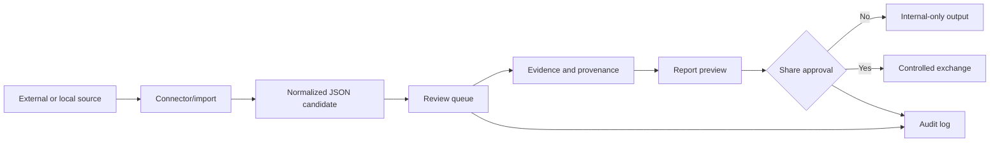

# LegoLens Core 3.0.1 — standards and functions

This document is the standards and functions addendum for the Full 3.0.1 README.

## Standards

| Area | Standards and conventions |
|---|---|
| Browser UI | HTML5, CSS3, JavaScript, route naming, LTR/RTL layout support. |
| Backend/API | Node.js, ECMAScript modules, HTTP, REST-like endpoints, JSON payloads. |
| Data | JSON seed registries, schema validation, runtime JSON separation. |
| Storage | SQLite-first model, SQL migrations, local runtime files. |
| GEO | GeoJSON, case-linked observations, map layers. |
| Documentation | Markdown, Mermaid diagrams, Git branch separation. |
| Review | Candidate-first ingestion, evidence/provenance links, audit logs. |
| Exchange | Separate share approval; `reviewed != share_approved`. |
| Governance | Source policy, decision logs, checklists, no-runtime-on-main rule. |
| i18n | 15 framework languages, LTR/RTL direction handling, shared canonical logic. |

## Exchange protocols and interoperability standards

| Protocol / standard | Direction | Used for | Boundary |
|---|---|---|---|
| Local HTTP API | UI to backend | Browser-to-Node communication through `/api/*`. | Local-first; shared deployment needs auth, roles and network controls. |
| REST-like resource endpoints | UI to backend | Version, health, app data, sources, review states, reports and storage status. | Endpoint access does not imply approval of the returned material. |
| JSON API payloads | UI, backend and runtime | Structured exchange of app data, source sets, candidates, review states and report metadata. | JSON structure is transport format, not validation of truth. |
| JSON seed registries | Package to runtime | Packaged cases, sources, schemas, templates and workflow configuration. | Seed data is reference data; runtime analyst state remains separate. |
| Runtime JSON files | Runtime to review workflow | Candidate queue, audit log and legacy import log. | Runtime files must not be committed to `main`. |
| Legacy JSON import | External/local file to candidate workflow | Mapping older data into traceable import/candidate records. | Import creates traceability, not automatic review approval. |
| GeoJSON | GEO layer to map/report context | Spatial features, case-linked observations and map layers. | Map data is context and must stay tied to source/review state. |
| RSS/feed-style ingestion | External source to connector layer | Feed-based source monitoring where configured. | Feed entries become candidates only. |
| Web HTTP/HTTPS source fetching | External web to connector layer | Web source collection and normalization where configured. | Fetched content is not trusted until reviewed. |
| Telegram connector convention | External channel/platform to connector layer | Telegram-oriented monitoring where configured. | Platform material enters as candidate material. |
| Social platform connector convention | External platforms to connector layer | Social media platform records and source mappings. | Platform-specific availability and terms apply; output is candidate-only. |
| Static repository/file exchange | Repository or local files to package/runtime | Static source sets, package files, docs and branch-based publication. | Repository presence is not evidence validation. |
| Report export interface | Reviewed material to local output | Local report previews and exportable report structures. | Report output can remain internal without share approval. |
| Controlled exchange workflow | Internal report to external sharing decision | Explicit approval gate before external use. | `reviewed != share_approved` remains mandatory. |
| Audit and decision-log records | Workflow transitions to governance trail | Review updates, exchange decisions and team governance. | Logs must preserve decisions instead of replacing review. |
| Git branch/archive convention | Repository publication and release separation | `main`, runtime branches and archives. | Keeps documentation, runtime and historical baselines separate. |

### Exchange model

The exchange model is intentionally conservative. LegoLens can ingest from external protocols and produce local outputs, but exchange is governed by review state, provenance, auditability and explicit share approval.

## Functions

| Function group | Main capabilities |
|---|---|
| Startup | Local backend, static UI serving, health and version checks. |
| Bootstrap | App data, routes, language framework, workflow configuration. |
| Sources | Source registry, source families, case links, source metadata. |
| Connectors | Connector registry, connector health and candidate-only ingestion. |
| Import | Legacy JSON import into traceable candidate/import records. |
| Review | Candidate queue, review states, review updates and conflict flags. |
| Evidence | Evidence chains, claim clusters and provenance graph. |
| GEO/media | Map layers, observations, media library, previews and thumbnails. |
| Timeline | Case chronology and dated updates with source context. |
| Reports | Report blueprints, report templates and local export previews. |
| Exchange | Controlled exchange after explicit share approval. |
| Team/governance | Team review, checklists, decision log and audit trail. |
| Storage | Storage status and database-first readiness context. |

## Boundary rules

1. Connectors and imports create candidates only.
2. Source records are metadata, not automatic endorsement.
3. Review state and share approval are separate.
4. Reports can be internal previews without being exchange-approved.
5. Runtime analyst data must not be committed to `main`.
6. External protocols are ingestion or transport mechanisms; they do not create trust by themselves.
7. Controlled exchange requires provenance, auditability and explicit share approval.
