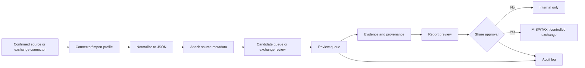

# LegoLens Core 3.0.1 — standards, sources, connectors and functions

This document is the standards, source, connector and function addendum for the Full 3.0.1 README.

Core boundary:

```text
reviewed != share_approved
```

Connector output, import output and manually added material enter as candidate material first. Review, evidence linking, report generation and external exchange remain separate stages.

---

## Evidence basis

This document was updated after inspecting the uploaded Full 3.0.1 archive:

```text
legolens_3_0_1_full.zip
```

The inspected archive contains, among other files:

```text
data/source_set.json
data/connector_registry.json
data/connector_operations_v46.json
data/connector_health.json
connectors/adapters/web.js
connectors/adapters/rss.js
connectors/adapters/telegram.js
connectors/adapters/social.js
connectors/adapters/staticRepo.js
src/connectors/adapterRunner.js
src/connectors/registry.js
schemas/source.schema.json
schemas/geojson.schema.json
```

The archive confirms these support counts and inventories:

| Capability | Count / value |
|---|---:|
| Package entries in uploaded archive | 378 |
| Source records in `data/source_set.json` | 196 |
| Source families in `data/source_set.json` | 25 |
| Connector records in `data/source_set.json` | 21 |
| Social media platforms in `data/source_set.json` | 20 |
| Connector records in `data/connector_registry.json` | 5 operational adapter records |
| Connector operation records in `data/connector_operations_v46.json` | 5 operational adapter records |
| Connector health records in `data/connector_health.json` | 5 operational adapter records |

The package therefore contains two related connector views:

1. **Full source-set connector inventory** — 21 records, including manual import, feeds, social/public platform connectors, MISP exchange and TAXII exchange.
2. **Operational adapter registry** — 5 local adapter contracts: web, RSS, Telegram, social and static repository.

---

## Confirmed source families from Full archive

The following 25 source families are present in `data/source_set.json`.

| Source family id | Name | Platforms | Status |
|---|---|---|---|
| `fam_brick_beat_battalion` | Brick Beat Battalion | YouTube | needs_review |
| `fam_community_reposts` | Community / Reposts | Facebook, Instagram | needs_review |
| `fam_explosive_media` | Explosive Media | Bluesky, Facebook, Instagram, Linkhub, Pinterest, Rumble, SoundCloud, Spotify, Telegram, Threads, TikTok, UpScrolled, X, YouTube | active |
| `fam_furkangozukara` | FurkanGozukara | X | active |
| `fam_media_coverage` | Media Coverage | Web | active |
| `fam_militarylego_ai_x_network` | Militarylego AI X Network | Facebook, Instagram, Threads, YouTube | needs_review |
| `fam_mirrors_linkhub` | Mirrors & Linkhub | BitChute, Telegram, other | active |
| `fam_persiaboi_studios` | PersiaBoi Studios | Web, X | needs_review |
| `fam_rock_id_official` | Rock ID Official | YouTube | needs_review |
| `fam_youtube_creators` | YouTube creators | YouTube | active |
| `project_repository` | Project repository | none listed | active |
| `institutional` | Institutional / humanitarian sources | Web | active |
| `public_social_connector_profile` | Public social connector profiles | BitChute, CSV, Facebook, Instagram, JSON, RSS, Reddit, Telegram, Threads, TikTok, Web, X, YouTube | available |
| `digital_resilience` | Digital resilience / civic tech | Web | needs_source_review |
| `official_open_data` | Official open data / dashboards | Web | active |
| `maritime_security` | Maritime security | Web | active |
| `fam_iran_diplomatic_ai_amplification` | Iranian diplomatic AI amplification accounts | Web, X | needs_source_review |
| `fam_revayat_fath_institute` | Revayat-e Fath Institute | Web | needs_source_review |
| `fam_southern_punk` | Southern Punk discovery | Web | needs_source_review |
| `fam_nukta_media` | Nukta Media discovery | Web | needs_source_review |
| `fam_sudan_humanitarian_social` | Sudan humanitarian and civil society social sources | Telegram, X | needs_source_review |
| `fam_gaza_humanitarian_media_social` | Gaza humanitarian, civil defence and media social sources | Telegram, Web, X | needs_source_review |
| `fam_ukraine_osint_social` | Ukraine OSINT and map social sources | Bluesky, Map, Telegram, X | needs_source_review |
| `fam_red_sea_maritime_social` | Red Sea Yemen maritime and incident social sources | Telegram, X | needs_source_review |
| `fam_sahel_osint_disinfo_social` | Sahel OSINT and disinformation social sources | Telegram, Web, X | needs_source_review |

---

## Confirmed social / public platforms from Full archive

`data/source_set.json` lists these 20 social/media/data platforms:

```text
YouTube, X, Instagram, Facebook, Threads, Telegram, TikTok, Reddit,
BitChute, Web, RSS, JSON, CSV, UpScrolled, Bluesky, Spotify,
SoundCloud, Rumble, Pinterest, Linkhub
```

These platforms are source and connector context. Platform presence does not make a record reviewed, reliable or share-approved.

---

## Full source-set connector inventory

The following 21 connector records are present in `data/source_set.json`.

| Connector id | Name | Type | Platform | Status | Output policy |
|---|---|---|---|---|---|
| `manual_url` | Manual URL import | manual | n/a | active | candidate_only |
| `rss` | RSS/Atom feed connector | feed | n/a | available | candidate_only |
| `json_feed` | JSON feed connector | feed | n/a | available | candidate_only |
| `csv_import` | CSV import | file | n/a | active | candidate_only |
| `youtube_public` | YouTube public source connector | social | YouTube | available | candidate_only |
| `x_public` | X public source connector | social | X | available | candidate_only |
| `instagram_public` | Instagram public source connector | social | Instagram | available | candidate_only |
| `facebook_public` | Facebook public source connector | social | Facebook | available | candidate_only |
| `threads_public` | Threads public source connector | social | Threads | available | candidate_only |
| `telegram_public` | Telegram public channel connector | social | Telegram | available | candidate_only |
| `web_archive` | Web/archive importer | archive | n/a | available | candidate_only |
| `openai` | ChatGPT/OpenAI candidate assistant | ai | n/a | available | candidate_only |
| `misp` | MISP exchange | exchange | n/a | available | share_approval_required |
| `taxii` | TAXII exchange | exchange | n/a | available | share_approval_required |
| `linkhub_public` | Public linkhub/social profile index | social | Linkhub | available | candidate_only |
| `upscrolled_public` | UpScrolled public profile connector | social | UpScrolled | available | candidate_only |
| `bluesky_public` | Bluesky public profile connector | social | Bluesky | available | candidate_only |
| `audio_platform_public` | Public audio platform connector | social | Audio | available | candidate_only |
| `rumble_public` | Rumble public profile connector | social | Rumble | available | candidate_only |
| `tiktok_public` | TikTok public profile connector | social | TikTok | available | candidate_only |
| `pinterest_public` | Pinterest public profile connector | social | Pinterest | available | candidate_only |

Required fields for the exchange connectors:

| Connector | Required fields |
|---|---|
| `misp` | `server_url`, `backend_key_ref`, `default_distribution`, `to_ids_policy` |
| `taxii` | `discovery_url`, `collection_id`, `auth_mode`, `backend_key_ref` |

---

## Operational adapter registry

`data/connector_registry.json`, `data/connector_operations_v46.json` and `data/connector_health.json` define the local operational adapter set. These are the adapters with concrete local adapter files in the archive.

| Adapter id | Type | Platform | Status | Output policy | Local adapter evidence |
|---|---|---|---|---|---|
| `web_public` | web | web | available / configured | candidate_only | `connectors/adapters/web.js` |
| `rss_public` | rss | rss | available / configured | candidate_only | `connectors/adapters/rss.js` |
| `telegram_public` | telegram | telegram | available / configured | candidate_only | `connectors/adapters/telegram.js` |
| `social_public` | social | x/youtube/tiktok/instagram | available / configured | candidate_only | `connectors/adapters/social.js` |
| `static_repo` | static | github/static | available / configured | candidate_only | `connectors/adapters/staticRepo.js` |

The operational adapter contract in `connector_operations_v46.json` is:

```text
configure, test_connection, dry_run, normalize, deduplicate,
write_candidate_only, log_errors
```

All operational adapters write to candidate queue only, keep secrets backend-only, use rate limiting and require manual review.

---

## Open standards assessment

This section reflects the actual evidence found in the uploaded Full 3.0.1 archive.

| Open standard | Status in current evidence | Evidence in archive | Documentation decision |
|---|---|---|---|
| MISP core format | Confirmed as available exchange connector. | `data/source_set.json` contains connector id `misp`, name `MISP exchange`, type `exchange`, status `available`, output policy `share_approval_required`. `app.js` exchange policy also mentions `MISP/TAXII backend-only`. | Document as supported exchange connector requiring share approval. |
| MISP taxonomies | Not separately confirmed. | No separate taxonomy schema/file/adapter found by text search. | Document only as possible mapping inside MISP exchange, not as independent supported feature. |
| MISP galaxies | Not separately confirmed. | No galaxy schema/file/adapter found by text search. | Do not claim active support. Mention only as future/enrichment mapping if implemented. |
| STIX 2.1 | Not explicitly confirmed. | Text search found no `STIX` occurrence in text/code/schema files. | Do not claim active STIX object support unless a STIX mapping file or schema is added. TAXII is confirmed, but STIX payload support is not separately evidenced. |
| TAXII 2.1 | Confirmed as available exchange connector. | `data/source_set.json` contains connector id `taxii`, name `TAXII exchange`, type `exchange`, status `available`, output policy `share_approval_required`, required fields `discovery_url`, `collection_id`, `auth_mode`, `backend_key_ref`. `app.js` exchange policy mentions `MISP/TAXII backend-only`. | Document as supported exchange connector requiring share approval. |
| TLP | Confirmed as share-approval field, not as full standalone schema. | `data/app_data.json` share approval framework requires `tlp`. | Document as governance/share marking field. Do not claim full TLP schema implementation unless added. |
| PAP | Not confirmed. | No text/code/schema occurrence found. | Do not claim support. |
| CACAO | Not confirmed. | No text/code/schema occurrence found. | Do not claim support. |
| OpenC2 | Not confirmed. | No text/code/schema occurrence found. | Do not claim support. |
| MITRE ATT&CK | Not confirmed as standard integration. | Only generic word `attack` appears in narrative keyword context; no MITRE ATT&CK schema or mapping found. | Do not claim support. |
| MITRE D3FEND | Not confirmed. | No text/code/schema occurrence found. | Do not claim support. |
| CAPEC | Not confirmed. | No text/code/schema occurrence found. | Do not claim support. |
| CVE | Not confirmed in text/code/schema files. | No reliable text occurrence found outside binary/image false positives. | Do not claim support. |
| CVSS | Not confirmed. | No text/code/schema occurrence found. | Do not claim support. |
| CWE | Not confirmed in text/code/schema files. | No reliable text occurrence found outside binary/image false positives. | Do not claim support. |
| CPE | Not confirmed in text/code/schema files. | No reliable text occurrence found outside binary/image false positives. | Do not claim support. |
| CSAF | Not confirmed. | No text/code/schema occurrence found. | Do not claim support. |
| OSV | Not confirmed in text/code/schema files. | No reliable text occurrence found outside unrelated text/image false positives. | Do not claim support. |
| Sigma | Not confirmed. | No text/code/schema occurrence found. | Do not claim support. |
| YARA | Not confirmed. | No text/code/schema occurrence found. | Do not claim support. |
| OpenIOC | Not confirmed. | No text/code/schema occurrence found. | Do not claim support. |
| IODEF | Not confirmed. | No text/code/schema occurrence found. | Do not claim support. |
| VERIS | Not confirmed. | No text/code/schema occurrence found. | Do not claim support. |

Rule: MISP and TAXII are confirmed exchange connectors in the full archive. STIX is not separately confirmed by name or schema in the inspected files, so STIX should not be claimed as implemented until a concrete STIX mapping/profile is added.

---

## Standards used by confirmed Full 3.0.1 capabilities

| Area | Standards and conventions |
|---|---|
| Browser UI | HTML5, CSS3, JavaScript, route naming, LTR/RTL layout support. |
| Backend/API | Node.js, ECMAScript modules, HTTP, REST-like endpoints, JSON payloads. |
| Data | JSON seed registries, schema validation, runtime JSON separation. |
| Feed ingestion | RSS/Atom connector and JSON feed connector. |
| File import | CSV import and legacy/local JSON-style import workflow. |
| Storage | SQLite-first model, SQL migrations, local runtime files. |
| GEO | GeoJSON, case-linked observations, map layers. |
| Documentation | Markdown, Mermaid diagrams, Git branch separation. |
| Review | Candidate-first ingestion, evidence/provenance links, audit logs. |
| Exchange | MISP exchange, TAXII exchange, share approval, `reviewed != share_approved`. |
| Governance | TLP field in share approval framework, source policy, decision logs, checklists, no-runtime-on-main rule. |
| i18n | 15 framework languages, LTR/RTL direction handling, shared canonical logic. |

---

## Connector lifecycle



---

## Functions

| Function group | Main capabilities |
|---|---|
| Startup | Local backend, static UI serving, health and version checks. |
| Bootstrap | App data, routes, language framework, workflow configuration. |
| Sources | Source registry, source families, case links, source metadata. |
| Connectors | 21 source-set connector records and 5 local operational adapter contracts. |
| Open exchange | MISP exchange and TAXII exchange, both share-approval required and backend-key based. |
| Import | Manual URL import, RSS/Atom feed, JSON feed, CSV import, web/archive import. |
| Review | Candidate queue, review states, review updates and conflict flags. |
| Evidence | Evidence chains, claim clusters and provenance graph. |
| GEO/media | Map layers, observations, media library, previews and thumbnails. |
| Timeline | Case chronology and dated updates with source context. |
| Reports | Report blueprints, report templates and local export previews. |
| Exchange | Controlled exchange after explicit share approval. |
| Team/governance | Team review, checklists, decision log and audit trail. |
| Storage | Storage status and database-first readiness context. |

---

## Boundary rules

1. Connectors and imports create candidates only unless explicitly documented as exchange connectors.
2. MISP and TAXII are exchange connectors and require share approval.
3. Source records are metadata, not automatic endorsement.
4. Review state and share approval are separate.
5. Reports can be internal previews without being exchange-approved.
6. Runtime analyst data must not be committed to `main`.
7. External protocols are ingestion or transport mechanisms; they do not create trust by themselves.
8. Open standards should only be documented as supported when a concrete connector, schema, adapter, endpoint or source-set connector record exists in the Full package.
9. Controlled exchange requires provenance, auditability and explicit share approval.
