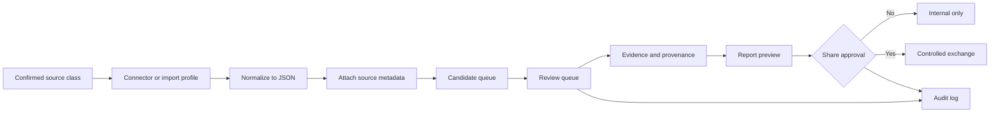

# LegoLens Core 3.0.1 — standards, sources, connectors and functions

This document is the standards, source, connector and function addendum for the Full 3.0.1 README.

Core boundary:

```text
reviewed != share_approved
```

Connector output, import output and manually added material enter as candidate material first. Review, evidence linking, report generation and external exchange remain separate stages.

---

## Evidence basis

This document is aligned with the Full 3.0.1 release documentation that is visible from the `prototype` tag and the runtime source-set that is visible in the repository. The release asset zip itself is referenced as:

```text
https://github.com/GJvManen/legolens-core/releases/download/prototype/legolens_3_0_1_full.zip
```

The directly visible Full 3.0.1 release documentation confirms:

| Capability | Count / value |
|---|---:|
| Package files | 338 |
| Source records | 196 |
| Source families | 25 |
| Connector records | 21 |
| Social media platforms | 20 |
| Case packs | 7 |
| Interface routes | 19 |
| GEO observations | 39 |
| GeoJSON features | 289 |
| Timeline updates | 21 |
| App report templates | 9 |
| Professional report templates | 7 |
| Database migrations | 3 |

The README-visible connector wording confirms support for these connector classes:

```text
web, RSS, Telegram, social and static repository adapters
```

The runtime source-set visible in the repository shows example source families for institutional, humanitarian, open-data and demo/local sources. The Full 3.0.1 README declares a larger full inventory of 25 source families and 196 source records, but the individual full inventory records are not present in the documentation branch as separate readable JSON files.

---

## Confirmed source categories

| Source category | Confirmed basis | Typical platform / input | LegoLens normalized output | Review boundary |
|---|---|---|---|---|
| Institutional sources | Runtime source-set example and source-registry layer | official or institution-linked web records | source record, candidate, case context | source presence is not endorsement |
| Humanitarian sources | Runtime source-set example and case-pack role descriptions | NGO, relief, crisis or civil-society web records | source record, candidate, timeline context | humanitarian status does not bypass review |
| Open data sources | Runtime source-set example and GEO/data layers | public datasets, map data, open records | source record, GeoJSON layer, candidate | open data still needs provenance and review |
| Demo/local sources | Runtime source-set example | local/demo records | demo source record | demo material is not production evidence |
| Web sources | Full README connector wording | HTTP/HTTPS pages and source URLs | normalized candidate with source metadata | fetched content remains candidate-only |
| RSS/feed sources | Full README connector wording | RSS/feed-style entries | candidate with feed attribution | feed presence is not validation |
| Telegram sources | Full README connector wording | Telegram/channel-oriented records | candidate with platform/source context | platform material requires review |
| Social platform sources | Full README count and connector wording | social media records across declared platforms | candidate mapped to source/case context | social content must not bypass review |
| Static repository sources | Full README connector wording | repository or static package files | reference data, import candidate or documentation record | repository presence is not proof |
| GEO sources | Full README GeoJSON/GEO counts | GeoJSON features and observations | map layers and spatial context | map display is context, not proof |
| Media/asset sources | Full README media/asset counts | thumbnails, previews, media assets | media-library record with attribution | media requires source and review state |
| Legacy local files | API surface and workflow documentation | older JSON/local structured records | legacy import log and candidate/mapped record | import creates traceability, not approval |
| Report/export sources | Report template/export endpoints | reviewed case material and templates | local report preview/export | report generation is not share approval |
| Audit/governance records | Audit/team endpoints | review updates, checklists, decision logs | audit and decision trail | logs document decisions; they do not replace review |

---

## Confirmed connector catalogue

| Connector family | Confirmed by | Protocol / standard | Typical input | Normalized output |
|---|---|---|---|---|
| Web connector | Full README connector wording | HTTP/HTTPS, HTML/text extraction | web pages, institutional pages, media pages | JSON candidate with source metadata |
| RSS/feed connector | Full README connector wording | RSS/Atom-style feed over HTTP/HTTPS | feed entries, headlines, links, timestamps | JSON candidate with feed attribution |
| Telegram connector | Full README connector wording | Telegram/channel connector convention | channel or post references | JSON candidate linked to platform/source context |
| Social connector | Full README connector wording and social platform count | platform-specific social conventions | posts, handles, URLs, timestamps | candidate mapped to source registry and case context |
| Static repository connector | Full README connector wording | Git/static file convention | repository files, packaged registries, static source sets | reference records or candidate/import records |
| Legacy import connector | API surface and workflow documentation | local file / JSON import convention | legacy JSON and local structured files | import log plus candidate or mapped records |
| GEO connector | Full README GEO/GeoJSON counts | GeoJSON and observation mapping | spatial features, coordinates, observation records | map layers and GEO observations |
| Media connector | Full README media/asset context | file/asset manifest convention | images, thumbnails, previews, media references | media-library records tied to source/case context |
| Report export connector | API surface and report workflow | local export/template convention | reviewed case material and templates | local report preview/export |
| Exchange connector | exchange route and share-approval workflow | controlled output convention | report preview plus approval decision | controlled exchange output or hold/reject state |
| Audit/governance connector | audit/team endpoints | decision trail convention | review updates, exchange decisions, import events | audit and decision-log records |
| Storage connector | storage endpoint and migrations | SQLite/JSON runtime convention | runtime state, migrations, storage status | storage status and durable-state readiness |

---

## Open standards assessment

The open standards below are relevant to intelligence and cyber-threat exchange. They are documented here as an interoperability assessment, not as confirmed active connector records, unless the Full 3.0.1 package explicitly exposes them in a connector registry.

| Open standard | Status in current evidence | Recommended LegoLens mapping if enabled |
|---|---|---|
| MISP core format | Not confirmed as an active Full 3.0.1 connector in visible release docs. | event, attribute, object, sighting, tag -> candidate/evidence/source metadata |
| MISP taxonomies | Not confirmed as active in visible release docs. | taxonomy tag -> source policy, confidence, TLP/share label |
| MISP galaxies | Not confirmed as active in visible release docs. | actor/tool/campaign/context -> entity or claim context |
| STIX 2.1 | Not confirmed as active in visible release docs. | indicator, observed-data, report, relationship, sighting -> evidence/provenance graph |
| TAXII 2.1 | Not confirmed as active in visible release docs. | TAXII collection -> candidate queue or controlled exchange package |
| TLP 2.0 | Not confirmed as active in visible release docs. | sharing label -> governance/share approval restriction |
| PAP | Not confirmed as active in visible release docs. | permitted actions -> exchange/governance label |
| CACAO | Not confirmed as active in visible release docs. | playbook steps -> checklist/workflow tasks |
| OpenC2 | Not confirmed as active in visible release docs. | action statement -> recommendation only, never automatic execution |
| MITRE ATT&CK | Not confirmed as active in visible release docs. | tactic/technique -> claim or evidence context |
| CVE / CVSS / CWE / CPE | Not confirmed as active in visible release docs. | vulnerability/advisory context -> report/evidence metadata |
| CSAF / OSV | Not confirmed as active in visible release docs. | advisory/package vulnerability -> candidate or report appendix |
| Sigma / YARA / OpenIOC | Not confirmed as active in visible release docs. | rule or IOC -> detection/evidence context |
| IODEF / VERIS | Not confirmed as active in visible release docs. | incident taxonomy -> timeline/report context |

Rule: do not claim active MISP, STIX/TAXII or other CTI-standard connector support until the Full 3.0.1 package exposes a concrete connector record, adapter, schema or endpoint for that standard.

---

## Standards used by confirmed Full 3.0.1 capabilities

| Area | Standards and conventions |
|---|---|
| Browser UI | HTML5, CSS3, JavaScript, route naming, LTR/RTL layout support. |
| Backend/API | Node.js, ECMAScript modules, HTTP, REST-like endpoints, JSON payloads. |
| Data | JSON seed registries, schema validation, runtime JSON separation. |
| Storage | SQLite-first model, SQL migrations, local runtime files. |
| GEO | GeoJSON, case-linked observations, map layers. |
| Documentation | Markdown, Mermaid diagrams, Git branch separation. |
| Review | Candidate-first ingestion, evidence/provenance links, audit logs. |
| Exchange | Separate share approval; `reviewed != share_approved`. |
| Governance | Source policy, decision logs, checklists, no-runtime-on-main rule. |
| i18n | 15 framework languages, LTR/RTL direction handling, shared canonical logic. |

---

## Connector lifecycle



---

## Functions

| Function group | Main capabilities |
|---|---|
| Startup | Local backend, static UI serving, health and version checks. |
| Bootstrap | App data, routes, language framework, workflow configuration. |
| Sources | Source registry, source families, case links, source metadata. |
| Connectors | Connector registry, connector health and candidate-only ingestion. |
| Import | Legacy JSON import into traceable candidate/import records. |
| Review | Candidate queue, review states, review updates and conflict flags. |
| Evidence | Evidence chains, claim clusters and provenance graph. |
| GEO/media | Map layers, observations, media library, previews and thumbnails. |
| Timeline | Case chronology and dated updates with source context. |
| Reports | Report blueprints, report templates and local export previews. |
| Exchange | Controlled exchange after explicit share approval. |
| Team/governance | Team review, checklists, decision log and audit trail. |
| Storage | Storage status and database-first readiness context. |

---

## Boundary rules

1. Connectors and imports create candidates only.
2. Source records are metadata, not automatic endorsement.
3. Review state and share approval are separate.
4. Reports can be internal previews without being exchange-approved.
5. Runtime analyst data must not be committed to `main`.
6. External protocols are ingestion or transport mechanisms; they do not create trust by themselves.
7. Open CTI standards such as MISP and STIX/TAXII should only be documented as supported when a concrete connector, schema, adapter or endpoint exists in the Full package.
8. Controlled exchange requires provenance, auditability and explicit share approval.
