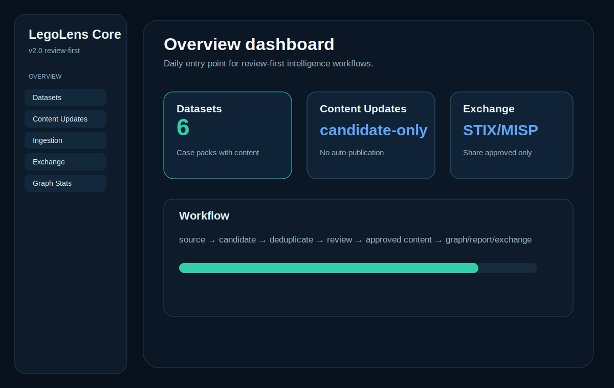
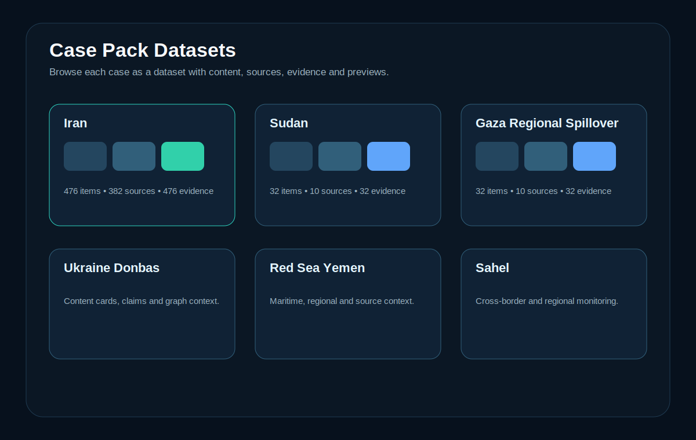
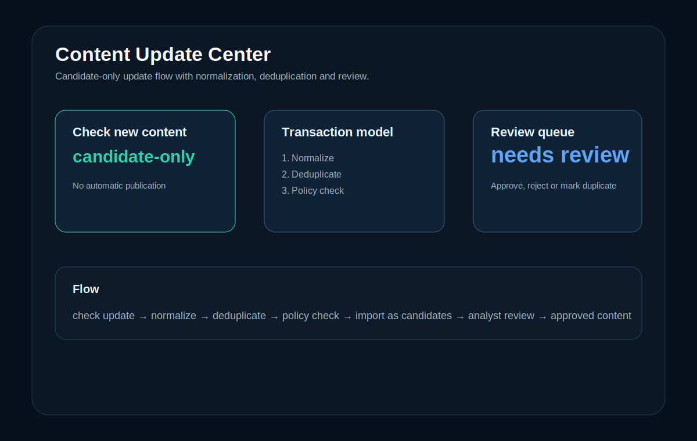
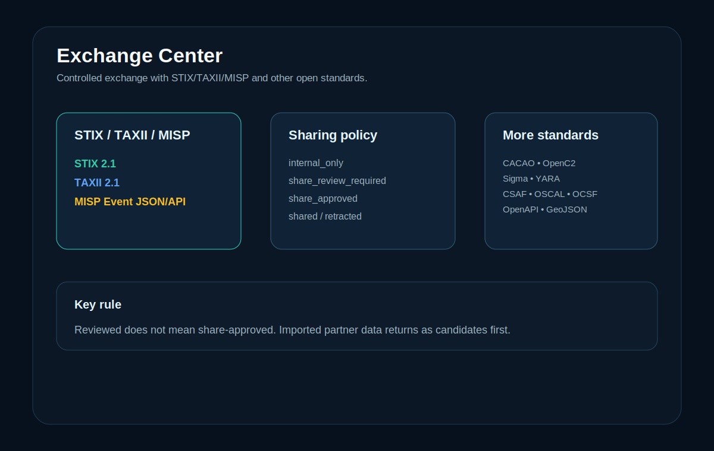
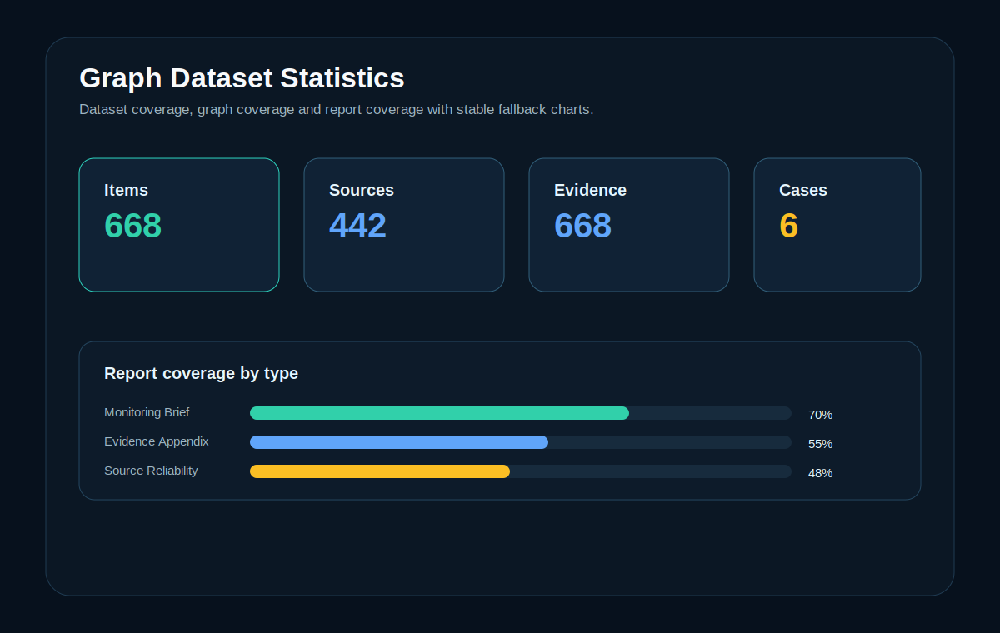

# LegoLens Core v2.0 — Screenshot Guide

This guide explains the main v2.0 interface areas. The images in this folder are lightweight SVG documentation mockups. They are intended for repository documentation and onboarding without committing large binary screenshot files.

## 1. Overview dashboard



The Overview dashboard is the daily starting point. It provides direct access to Datasets, Content Updates, Ingestion, Exchange and Graph Stats.

Key purpose:

- show the main v2.0 work areas;
- keep analyst navigation simple;
- avoid duplicating workbench shortcuts in the main canvas;
- preserve legacy analytics while introducing v2 workflows.

## 2. Case Pack Datasets



The Datasets section makes every case pack visible and accessible. Each case pack is represented as a dataset with content counts, source counts, evidence counts and preview imagery.

Key purpose:

- make non-Iran case packs discoverable;
- show that every case pack has content;
- provide a direct path to create review candidates from a case dataset.

## 3. Content Update Center



The Content Update Center implements the candidate-only update pattern.

Flow:

```text
check update → normalize → deduplicate → policy check → import as candidates → review
```

Key purpose:

- prevent direct publication;
- show newly discovered material as candidates;
- keep update runs auditable;
- prepare future rollback support.

## 4. Ingestion and External Connections


The Ingestion Center and External Connections area define how LegoLens connects to sources and external systems.

Supported directions:

- RSS;
- JSON feed;
- CSV import;
- Manual URL import;
- ChatGPT/OpenAI connector template;
- MISP server template;
- TAXII server template;
- STIX file exchange.

Security rule:

```text
No secrets in frontend code.
```

## 5. Exchange Center



The Exchange Center is for controlled sharing and import/export with intelligence-sharing standards.

Supported or planned standards:

- STIX 2.1;
- TAXII 2.1;
- MISP;
- MISP Taxonomies;
- MISP Galaxies;
- CACAO;
- OpenC2;
- Sigma;
- YARA;
- CSAF;
- OSCAL;
- OCSF;
- MITRE ATT&CK;
- OpenAPI;
- GeoJSON;
- SPDX;
- CycloneDX.

Key rule:

```text
reviewed does not mean share-approved
```

## 6. Graph Dataset Statistics



The Graph Stats section summarizes dataset and graph coverage across cases.

Key metrics:

- item coverage;
- source coverage;
- evidence coverage;
- report coverage by type;
- node and edge distribution;
- case-pack coverage.

Charts should always include numeric labels and bar fallbacks so that information remains readable if a chart renderer fails.
